# GPT 실험 기록지

이 문서는 하이퍼파라미터를 조금씩 바꿔가며 어떤 값이 GPT 성능에 좋은지 기록하기 위한 작업 노트다. 정식 리포트라기보다, 실험하면서 알게 된 개념과 결과를 바로 이어서 적는 용도로 쓴다.

## 현재 기준 설정

현재 dropout 실험은 아래 기본값을 기준으로 진행했다.

```python
BASE_CONFIG_50 = {
    "vocab_size": 2000,
    "context_length": 128,
    "emb_dim": 128,
    "n_heads": 4,
    "n_layers": 2,
    "drop_rate": 0.1,
    "qkv_bias": False,
}

learning_rate = 3e-4
batch_size = 32
optimizer = AdamW
epochs = 50
seed = 42
```

기본 dropout 값은 `0.1`이었고, 이 상태에서 dropout만 바꿔가며 validation loss가 어떻게 달라지는지 확인했다.

## Dropout이 하는 일

`dropout`은 학습 중에 모델 내부의 일부 출력값을 랜덤하게 0으로 만드는 비율이다.

예를 들어 `dropout=0.14`면 학습하는 동안 중간 표현의 일부 약 14%를 랜덤하게 꺼버린다. 매번 같은 위치를 끄는 것이 아니라 batch마다 랜덤하게 바뀐다.

이 값을 쓰는 이유는 과적합을 줄이기 위해서다. 모델이 train 데이터만 너무 외우면 train loss는 낮아지지만 validation loss는 높아질 수 있다. dropout은 일부 정보를 일부러 가려서 모델이 특정 뉴런이나 특정 패턴 하나에 지나치게 의존하지 못하게 만든다.

값이 너무 낮으면 모델이 train 데이터를 쉽게 외울 수 있다.

```text
dropout = 0.0
train loss는 낮아지지만 validation loss가 나빠질 수 있음
```

값이 적당하면 train loss는 조금 높아질 수 있지만 validation loss가 좋아질 수 있다.

```text
dropout = 0.1 ~ 0.15 근처
현재 실험에서는 이 구간이 가장 좋았음
```

값이 너무 높으면 너무 많은 정보를 꺼버려서 모델이 충분히 배우지 못할 수 있다.

```text
dropout = 0.3
규제가 너무 강해서 성능이 다시 나빠질 수 있음
```

따라서 dropout은 "학습 중 일부 연결을 랜덤하게 꺼서 과적합을 줄이는 규제 강도"라고 볼 수 있다.

## Dropout 실험 결과

### 넓은 범위 확인

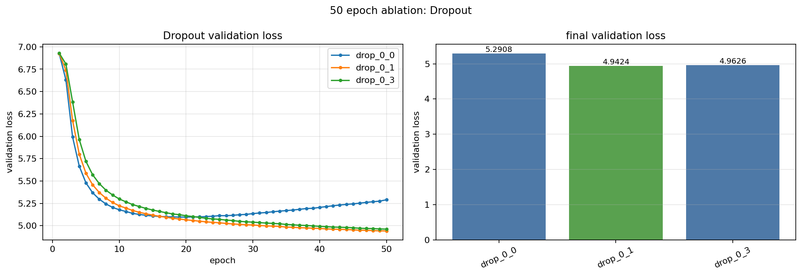

결과 파일:

- `checkpoints/ablation50/ablation50_dropout_20260602_190311_797.json`
- `figures/ablation50/ablation50_dropout_20260602_190311_797.png`

| label | 실제 drop_rate | final train loss | final val loss | best val loss | val-train gap |
|---|---:|---:|---:|---:|---:|
| drop_0_1 | 0.10 | 4.7340 | 4.9424 | 4.9424 | +0.2085 |
| drop_0_3 | 0.20 | 4.8835 | 4.9626 | 4.9626 | +0.0791 |
| drop_0_0 | 0.00 | 4.3044 | 5.2908 | 5.0968 | +0.9864 |

해석:

- `dropout=0.0`은 train loss가 가장 낮지만 validation loss가 가장 나쁘다. 과적합이 강하게 나타난다.
- `dropout=0.2`는 gap은 줄지만 validation loss가 `0.1`보다 나쁘다.
- 이 결과만 보면 `0.1` 근처를 더 세밀하게 볼 필요가 있다.

### 0.10 근처 세밀 비교

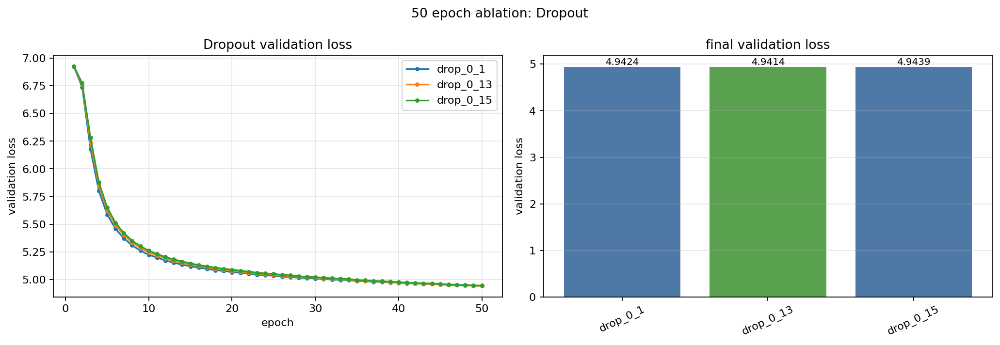

결과 파일:

- `checkpoints/ablation50/ablation50_dropout_20260602_191213_912.json`
- `figures/ablation50/ablation50_dropout_20260602_191213_912.png`

| label | 실제 drop_rate | final train loss | final val loss | best val loss | val-train gap |
|---|---:|---:|---:|---:|---:|
| drop_0_13 | 0.13 | 4.7868 | 4.9414 | 4.9414 | +0.1545 |
| drop_0_1 | 0.10 | 4.7340 | 4.9424 | 4.9424 | +0.2085 |
| drop_0_15 | 0.15 | 4.8173 | 4.9439 | 4.9439 | +0.1266 |

해석:

- `0.13`이 `0.10`보다 약간 좋았다.
- `0.15`는 regularization은 더 강하지만 validation loss가 살짝 나빠졌다.
- 좋은 구간이 `0.12 ~ 0.14` 근처로 좁혀졌다.

### 0.12, 0.13, 0.14 비교

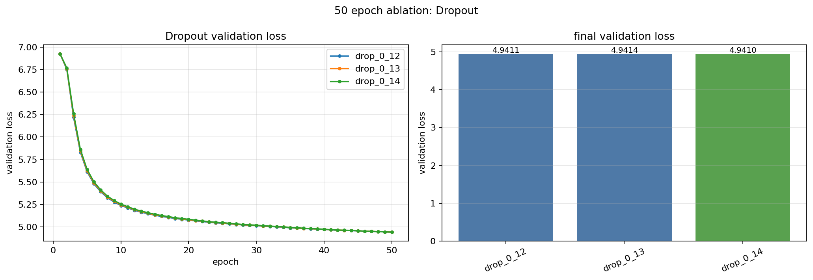

결과 파일:

- `checkpoints/ablation50/ablation50_dropout_20260602_225242_613.json`
- `figures/ablation50/ablation50_dropout_20260602_225242_613.png`

| label | 실제 drop_rate | final train loss | final val loss | best val loss | val-train gap |
|---|---:|---:|---:|---:|---:|
| drop_0_14 | 0.14 | 4.8019 | 4.9410 | 4.9410 | +0.1391 |
| drop_0_12 | 0.12 | 4.7706 | 4.9411 | 4.9411 | +0.1706 |
| drop_0_13 | 0.13 | 4.7868 | 4.9414 | 4.9414 | +0.1545 |

해석:

- `0.14`가 가장 낮은 validation loss를 보였다.
- `0.12`, `0.13`, `0.14`의 차이는 매우 작다.
- 그래도 현재 기준 설정에서는 `0.14`가 가장 좋은 후보로 보인다.

### 0.10, 0.14, 0.18 재확인

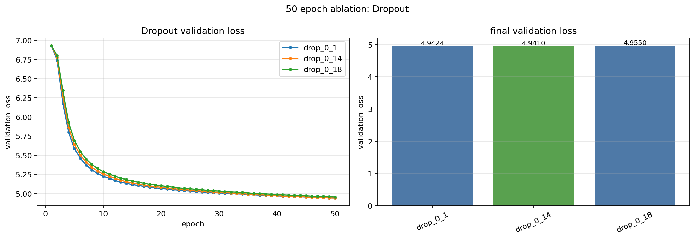

결과 파일:

- `checkpoints/ablation50/ablation50_dropout_20260602_230007_406.json`
- `figures/ablation50/ablation50_dropout_20260602_230007_406.png`

| label | 실제 drop_rate | final train loss | final val loss | best val loss | val-train gap |
|---|---:|---:|---:|---:|---:|
| drop_0_14 | 0.14 | 4.8019 | 4.9410 | 4.9410 | +0.1391 |
| drop_0_1 | 0.10 | 4.7340 | 4.9424 | 4.9424 | +0.2085 |
| drop_0_18 | 0.18 | 4.8592 | 4.9550 | 4.9550 | +0.0958 |

해석:

- `0.14`가 다시 가장 좋게 나왔다.
- `0.18`은 gap은 작지만 validation loss가 나빠졌다.
- `0.10`보다 `0.14`가 근소하게 좋다.

## Dropout 현재 결론

현재 기본 설정에서 dropout만 바꿔 본 결과, 가장 좋은 값은 `drop_rate=0.14`다.

```text
best so far: drop_rate = 0.14
final val loss = 4.9410
best val loss = 4.9410
```

다만 `0.12`, `0.13`, `0.14`의 차이는 아주 작다. 따라서 이 결론은 "현재 baseline 기준에서는 0.14가 가장 좋았다"로 기록한다.

다른 하이퍼파라미터를 바꾸면 dropout 최적값도 다시 달라질 수 있다. 예를 들어 model size, learning rate, batch size, context length가 바뀌면 과적합 정도가 바뀌므로 dropout도 다시 확인해야 한다.

앞으로는 일단 `dropout=0.14`를 좋은 후보로 기억하고, 다른 수치를 실험한 뒤 최종 조합 근처에서 다시 `0.10 / 0.12 / 0.14 / 0.16 / 0.18` 정도를 재확인한다.

## Learning rate가 하는 일

`learning_rate`는 optimizer가 loss를 줄이기 위해 모델 파라미터를 한 번에 얼마나 크게 업데이트할지 정하는 값이다.

모델은 매 batch마다 gradient를 보고 "이 방향으로 가면 loss가 줄어든다"는 신호를 얻는다. 이때 learning rate는 그 방향으로 움직이는 보폭이다.

예를 들어 `learning_rate=5e-3`은 소수로 쓰면 `0.005`다. `5e-4`는 `0.0005`, `5e-2`는 `0.05`이므로 `5e-3`은 그 중간 정도의 learning rate다.

값이 너무 작으면 파라미터가 조금씩만 바뀌어서 학습이 느리다.

```text
learning_rate = 5e-4
업데이트 보폭이 작아서 loss가 천천히 내려감
```

값이 적당하면 loss가 빠르게 내려가면서 validation loss도 좋아질 수 있다.

```text
learning_rate = 5e-3 근처
현재 실험에서는 이 구간이 가장 좋았음
```

값이 너무 크면 좋은 방향을 향해 가더라도 한 번에 너무 크게 움직여서 최적점을 지나치거나 학습이 불안정해질 수 있다.

```text
learning_rate = 5e-2
loss가 튀거나 validation loss가 다시 나빠질 수 있음
```

따라서 learning rate는 "모델이 매번 얼마나 과감하게 배우는지 정하는 보폭"이라고 볼 수 있다. dropout이 과적합을 줄이는 규제 강도라면, learning rate는 학습 속도와 안정성에 직접 영향을 주는 값이다.

## Learning rate 실험 결과

이번 learning rate 실험은 앞에서 찾은 dropout 최적값인 `drop_rate=0.14`를 기준으로 진행했다. 기본 `BASE_CONFIG_50` 자체는 바꾸지 않고, learning rate 실험을 실행할 때만 `base_overrides={"drop_rate": 0.14}`를 적용했다.

실험 전 가설:

- learning rate가 너무 작으면 학습이 느리고 loss 개선이 약할 수 있다.
- learning rate가 너무 크면 학습이 불안정해지거나 validation loss가 나빠질 수 있다.
- dropout이 `0.14`일 때 가장 안정적으로 낮은 validation loss를 만드는 learning rate를 찾는다.

### 넓은 범위 확인

처음에는 작은 값, 중간 값, 너무 큰 값을 함께 비교했다. `5e-4`는 학습이 느렸고, `5e-2`는 너무 커서 loss가 크게 나빠졌다. `5e-3`이 가장 좋은 후보로 보였다.

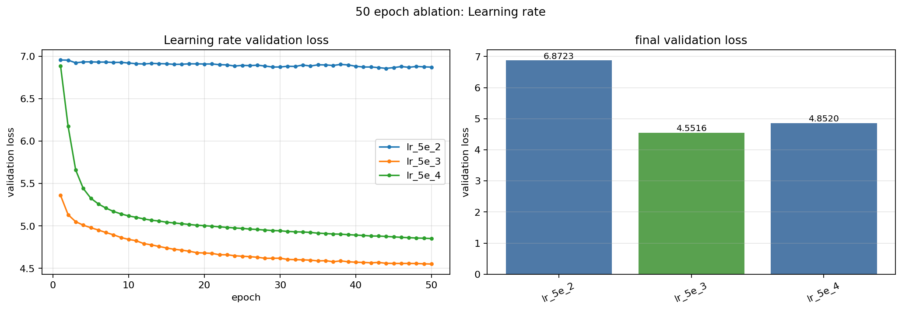

결과 파일:

- `checkpoints/ablation50/ablation50_learning_rate_20260603_015016_930.json`
- `figures/ablation50/ablation50_learning_rate_20260603_015016_930.png`

| label | learning_rate | final train loss | final val loss | best val loss | 메모 |
|---|---:|---:|---:|---:|---|
| lr_5e_4 | 0.0005 | 4.6869 | 4.8520 | 4.8520 | 너무 작아서 개선이 느림 |
| lr_5e_3 | 0.005 | 4.3481 | 4.5516 | 4.5516 | 가장 좋은 후보 |
| lr_5e_2 | 0.05 | 6.8826 | 6.8723 | 6.8572 | 너무 커서 학습이 불안정함 |

해석:

- `5e-4`는 loss가 내려가기는 하지만 `5e-3`보다 validation loss가 훨씬 높다.
- `5e-2`는 너무 큰 learning rate라서 loss가 제대로 줄지 않는다.
- 이 결과만 보면 `5e-3` 근처를 더 세밀하게 확인하는 것이 좋다.

### 3e-3, 4e-3, 5e-3 비교

`5e-3`이 좋은 후보로 보였기 때문에, 그보다 작은 `3e-3`, `4e-3`과 비교했다.


결과 파일:

- `checkpoints/ablation50/ablation50_learning_rate_20260603_013649_239.json`
- `figures/ablation50/ablation50_learning_rate_20260603_013649_239.png`

| label | learning_rate | final train loss | final val loss | best val loss | 메모 |
|---|---:|---:|---:|---:|---|
| lr_3e_3 | 0.003 | 4.3853 | 4.5831 | 4.5831 | 아직 작은 편 |
| lr_4e_3 | 0.004 | 4.3640 | 4.5667 | 4.5667 | `3e-3`보다 좋아짐 |
| lr_5e_3 | 0.005 | 4.3481 | 4.5516 | 4.5516 | 가장 낮은 final val loss |

해석:

- `3e-3`에서 `4e-3`, `5e-3`으로 올릴수록 validation loss가 낮아졌다.
- 이 구간에서는 learning rate를 조금 더 키우는 것이 도움이 되었다.
- `5e-3`이 가장 좋은 후보로 유지되었다.

### 5e-3 주변 재확인

`5e-3` 주변을 더 촘촘하게 보기 위해 `4.9e-3`, `5e-3`, `5.1e-3`을 비교했다.

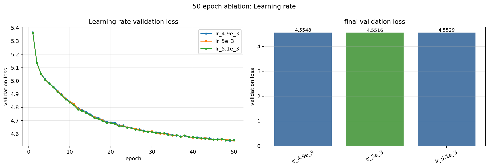

결과 파일:

- `checkpoints/ablation50/ablation50_learning_rate_20260603_021635_000.json`
- `figures/ablation50/ablation50_learning_rate_20260603_021635_000.png`

| label | learning_rate | final train loss | final val loss | best val loss | 메모 |
|---|---:|---:|---:|---:|---|
| lr_4.9e_3 | 0.0049 | 4.3504 | 4.5548 | 4.5497 | `5e-3`보다 final val loss가 높음 |
| lr_5e_3 | 0.005 | 4.3481 | 4.5516 | 4.5516 | final val loss 기준 가장 좋음 |
| lr_5.1e_3 | 0.0051 | 4.3459 | 4.5529 | 4.5522 | train loss는 낮지만 val loss는 `5e-3`보다 높음 |

해석:

- `5e-3`이 final validation loss 기준으로 가장 좋다.
- `4.9e-3`은 best val loss만 보면 `5e-3`보다 약간 낮은 순간이 있지만, 마지막 epoch 기준 validation loss는 `5e-3`이 더 낮다.
- `5.1e-3`은 train loss는 더 낮지만 validation loss는 살짝 나빠졌다. learning rate가 커지면서 train 쪽은 더 빨리 내려가지만 validation 성능은 더 좋아지지 않는 것으로 보인다.

## Learning rate 현재 결론

`drop_rate=0.14`를 기준으로 learning rate만 바꿔 본 결과, 현재 가장 좋은 값은 `learning_rate=5e-3`이다.

```text
best so far: learning_rate = 5e-3
decimal form: 0.005
drop_rate = 0.14
final train loss = 4.3481
final val loss = 4.5516
best val loss = 4.5516
```

이번 결과는 기본 세팅에서 바로 learning rate를 바꾼 것이 아니라, 이전 실험에서 찾은 `drop_rate=0.14`를 적용한 상태에서 나온 결과다. 따라서 현재까지의 순차 튜닝 후보는 아래처럼 기록한다.

```text
drop_rate = 0.14
learning_rate = 5e-3
```

앞으로는 일단 `learning_rate=5e-3`을 좋은 후보로 기억하고, 다음 하이퍼파라미터 실험은 `drop_rate=0.14`, `learning_rate=5e-3`을 기준으로 진행한다. 최종 조합 근처에서는 seed를 바꾸거나 `4.9e-3 / 5e-3 / 5.1e-3`을 다시 확인해도 좋다.

## Optimizer와 weight decay가 하는 일

`optimizer`는 gradient를 보고 모델 파라미터를 어떤 방식으로 업데이트할지 정하는 알고리즘이다. 같은 learning rate를 쓰더라도 optimizer가 다르면 파라미터를 움직이는 방식이 달라져 학습 속도와 안정성이 달라질 수 있다.

이번 실험에서 비교한 optimizer는 `AdamW`, `Adam`, `SGD`다.

`SGD`는 기본적인 gradient 방향으로 움직이는 방식이다. 단순하지만 이 실험에서는 같은 epoch 안에서 충분히 빠르게 loss를 낮추기 어려웠다.

`Adam`은 gradient의 평균과 크기 변화를 함께 보면서 각 파라미터마다 업데이트 크기를 조절한다. 보통 SGD보다 빠르게 학습되지만, 현재 설정에서는 일부 weight decay 값에서 validation loss가 확 튀는 불안정한 그래프가 나타났다.

`AdamW`는 Adam 계열 optimizer이지만 weight decay를 Adam의 gradient update와 분리해서 적용한다. 이 때문에 weight decay를 쓸 때 Adam보다 더 안정적으로 동작하는 경우가 많다.

`weight_decay`는 파라미터 값이 너무 커지지 않도록 누르는 규제 항이다. dropout이 학습 중 일부 출력을 랜덤하게 꺼서 과적합을 줄인다면, weight decay는 파라미터 크기 자체를 작게 유지하도록 압력을 준다.

값이 너무 작으면 규제 효과가 거의 없다.

```text
weight_decay = 0.0
파라미터 크기를 따로 누르지 않음
```

값이 적당하면 validation loss가 낮아지고 그래프가 안정적일 수 있다.

```text
AdamW weight_decay = 0.06
현재 실험에서는 loss도 낮고 그래프도 안정적이었음
```

값이 너무 크거나 optimizer와 잘 맞지 않으면 학습이 느려지거나 validation loss가 튈 수 있다.

```text
Adam weight_decay 일부 후보
loss가 내려가다가 특정 epoch에서 확 튀는 현상이 나타남
```

따라서 optimizer와 weight decay 실험은 "어떤 방식으로 파라미터를 업데이트할지"와 "파라미터 크기를 얼마나 규제할지"를 함께 정하는 과정이라고 볼 수 있다.

## Optimizer and weight decay 실험 결과

이번 실험은 앞에서 찾은 현재 최적 후보를 기준으로 진행했다.

```text
drop_rate = 0.14
learning_rate = 5e-3
```

기본 `BASE_CONFIG_50` 자체는 바꾸지 않고, optimizer/weight decay 실험을 실행할 때만 `base_overrides={"drop_rate": 0.14, "learning_rate": 5e-3}`를 적용했다.

실험 전 가설:

- `AdamW`는 weight decay를 분리해서 적용하므로 weight decay를 사용할 때 `Adam`보다 안정적일 수 있다.
- `weight_decay=0.0`보다 적당한 양의 weight decay가 validation loss를 낮출 수 있다.
- weight decay가 너무 커지면 학습이 눌리거나 불안정해져 validation loss가 나빠질 수 있다.
- 그래프가 안정적으로 내려가는지도 loss 숫자만큼 중요하게 본다.

### Optimizer 종류와 초기 weight decay 비교

처음에는 optimizer 종류와 기본적인 weight decay 후보를 비교했다. 이 단계에서는 `AdamW`, `Adam`, `SGD`가 현재 설정에서 어느 정도 경쟁력이 있는지 확인했다.

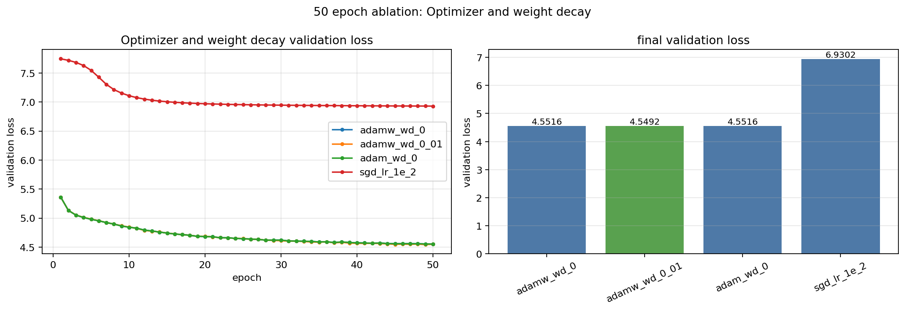

결과 파일:

- `checkpoints/ablation50/ablation50_optimizer_weight_decay_20260603_023305_186.json`
- `figures/ablation50/ablation50_optimizer_weight_decay_20260603_023305_186.png`

| label | optimizer | weight_decay | learning_rate | final train loss | final val loss | best val loss | 메모 |
|---|---|---:|---:|---:|---:|---:|---|
| adamw_wd_0 | AdamW | 0.00 | 0.005 | 4.3481 | 4.5516 | 4.5516 | 기준 후보 |
| adamw_wd_0_01 | AdamW | 0.01 | 0.005 | 4.3535 | 4.5492 | 4.5492 | `wd=0`보다 약간 좋아짐 |
| adam_wd_0 | Adam | 0.00 | 0.005 | 4.3481 | 4.5516 | 4.5516 | weight decay가 없으면 AdamW와 거의 같음 |
| sgd_lr_1e_2 | SGD | 0.00 | 0.01 | 6.9366 | 6.9302 | 6.9302 | loss가 충분히 내려가지 않음 |

해석:

- `SGD`는 이 설정에서 50 epoch 동안 loss를 충분히 낮추지 못했다.
- `AdamW`와 `Adam`은 weight decay가 없을 때 거의 같은 결과를 보였다.
- `AdamW weight_decay=0.01`이 `0.0`보다 아주 약간 좋아져서, AdamW의 weight decay를 더 넓게 탐색할 필요가 생겼다.

### AdamW weight decay 탐색

AdamW에서 weight decay를 점점 키우며 비교했다. `0.03 ~ 0.06` 구간에서 validation loss가 낮아졌고, 그래프도 큰 튐 없이 안정적으로 내려갔다.

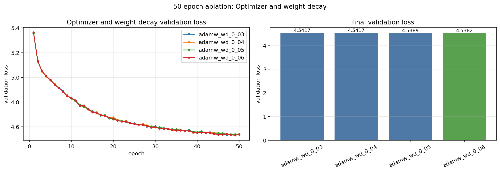

결과 파일:

- `checkpoints/ablation50/ablation50_optimizer_weight_decay_20260603_025746_506.json`
- `figures/ablation50/ablation50_optimizer_weight_decay_20260603_025746_506.png`

| label | optimizer | weight_decay | final train loss | final val loss | best val loss | best epoch | 메모 |
|---|---|---:|---:|---:|---:|---:|---|
| adamw_wd_0_03 | AdamW | 0.03 | 4.3834 | 4.5417 | 4.5340 | 47 | 안정적으로 감소 |
| adamw_wd_0_04 | AdamW | 0.04 | 4.4006 | 4.5417 | 4.5329 | 49 | 안정적으로 감소 |
| adamw_wd_0_05 | AdamW | 0.05 | 4.4184 | 4.5389 | 4.5389 | 50 | final val loss 개선 |
| adamw_wd_0_06 | AdamW | 0.06 | 4.4324 | 4.5382 | 4.5314 | 49 | 가장 좋은 후보 |

해석:

- weight decay를 `0.03` 이상으로 올리자 final validation loss가 `4.54` 근처까지 내려갔다.
- `adamw_wd_0_06`은 final val loss가 가장 낮고, best val loss도 가장 낮은 축에 속한다.
- 그래프가 매끈하게 내려가므로 학습 안정성도 좋다.

`0.06`보다 더 큰 값도 확인했다.

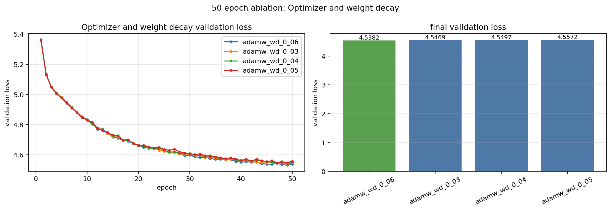

결과 파일:

- `checkpoints/ablation50/ablation50_optimizer_weight_decay_20260603_030540_680.json`
- `figures/ablation50/ablation50_optimizer_weight_decay_20260603_030540_680.png`

| label | 실제 weight_decay | final train loss | final val loss | best val loss | 메모 |
|---|---:|---:|---:|---:|---|
| adamw_wd_0_06 | 0.06 | 4.4324 | 4.5382 | 4.5314 | 가장 좋은 후보 유지 |
| adamw_wd_0_03 | 0.07 | 4.4517 | 4.5469 | 4.5372 | `0.06`보다 나빠짐 |
| adamw_wd_0_04 | 0.08 | 4.4675 | 4.5497 | 4.5427 | 더 나빠짐 |
| adamw_wd_0_05 | 0.09 | 4.4820 | 4.5572 | 4.5474 | 규제가 더 강해져 성능 하락 |

해석:

- `0.07`, `0.08`, `0.09`는 `0.06`보다 final validation loss가 높아졌다.
- AdamW에서는 `weight_decay=0.06` 근처가 현재 좋은 지점으로 보인다.

### Adam weight decay 탐색과 불안정한 그래프

Adam도 weight decay를 바꿔가며 실험했다. 하지만 Adam의 non-zero weight decay 후보들은 AdamW보다 validation loss가 높았고, 일부 그래프는 loss가 내려가다가 특정 epoch에서 확 튀었다.

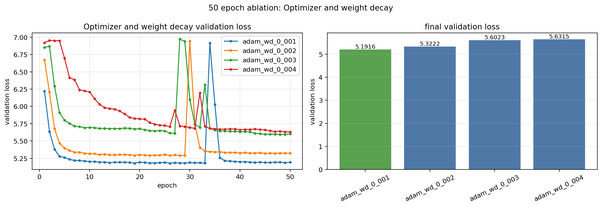

결과 파일:

- `checkpoints/ablation50/ablation50_optimizer_weight_decay_20260603_150330_990.json`
- `figures/ablation50/ablation50_optimizer_weight_decay_20260603_150330_990.png`

| label | optimizer | weight_decay | final train loss | final val loss | best val loss | 튄 지점 |
|---|---|---:|---:|---:|---:|---|
| adam_wd_0_001 | Adam | 0.001 | 5.2593 | 5.1916 | 5.1777 | epoch 34에서 크게 상승 |
| adam_wd_0_002 | Adam | 0.002 | 5.4186 | 5.3222 | 5.2888 | epoch 30에서 크게 상승 |
| adam_wd_0_003 | Adam | 0.003 | 5.6802 | 5.6023 | 5.5953 | epoch 28, 33 부근에서 상승 |
| adam_wd_0_004 | Adam | 0.004 | 5.7321 | 5.6315 | 5.6315 | epoch 27, 32 부근에서 상승 |

해석:

- `adam_wd_0_001`은 초반에 validation loss가 `5.18` 근처까지 내려갔지만 epoch 34에서 `6.91` 근처로 확 튀었다가 다시 내려왔다.
- `adam_wd_0_002`도 epoch 30에서 validation loss가 `6.94` 근처까지 튀었다.
- `adam_wd_0_003`, `adam_wd_0_004`도 중간에 loss가 확 올라가는 구간이 보인다.
- Adam 계열 non-zero weight decay는 loss 숫자도 AdamW보다 높고, 그래프 안정성도 떨어졌다.

이 현상은 Adam의 weight decay 적용 방식이 현재 설정과 잘 맞지 않았을 가능성을 보여준다. loss가 한동안 내려가더라도 중간에 크게 튄다면 최종 모델 후보로 쓰기에는 위험하다.

### AdamW 최적 후보와 Adam 후보 최종 비교

AdamW에서 가장 좋아 보인 `adamw_wd_0_06`과 Adam 쪽 후보를 직접 비교했다.

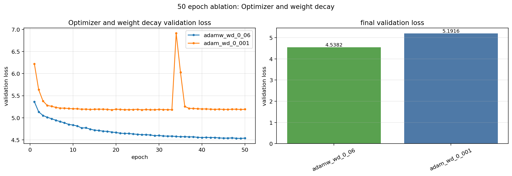

결과 파일:

- `checkpoints/ablation50/ablation50_optimizer_weight_decay_20260603_151406_565.json`
- `figures/ablation50/ablation50_optimizer_weight_decay_20260603_151406_565.png`

| label | optimizer | weight_decay | final train loss | final val loss | best val loss | 그래프 |
|---|---|---:|---:|---:|---:|---|
| adamw_wd_0_06 | AdamW | 0.06 | 4.4324 | 4.5382 | 4.5314 | 안정적으로 감소 |
| adam_wd_0_001 | Adam | 0.001 | 5.2593 | 5.1916 | 5.1777 | epoch 34에서 크게 튐 |

해석:

- `adamw_wd_0_06`은 loss가 안정적으로 내려가며 final val loss도 낮다.
- `adam_wd_0_001`은 중간에 validation loss가 크게 튀고, 최종 validation loss도 `adamw_wd_0_06`보다 높다.
- 따라서 현재 조합에서는 `AdamW + weight_decay=0.06`이 가장 좋은 선택으로 보인다.

## Optimizer and weight decay 현재 결론

`drop_rate=0.14`, `learning_rate=5e-3`를 기준으로 optimizer와 weight decay를 비교한 결과, 현재 가장 좋은 조합은 `AdamW`에 `weight_decay=0.06`을 쓰는 것이다.

```text
best so far:
drop_rate = 0.14
learning_rate = 5e-3
optimizer = AdamW
weight_decay = 0.06

final train loss = 4.4324
final val loss = 4.5382
best val loss = 4.5314
```

AdamW는 `0.03 ~ 0.06` 구간에서 그래프가 안정적으로 내려갔고, `0.06`이 final validation loss 기준으로 가장 좋았다. 반면 Adam의 non-zero weight decay 실험은 validation loss가 크게 튀는 구간이 있었고, 최종 loss도 높았다.

앞으로는 다음 하이퍼파라미터 실험을 아래 조합을 기준으로 진행한다.

```text
drop_rate = 0.14
learning_rate = 5e-3
optimizer = AdamW
weight_decay = 0.06
```

## Context length가 하는 일

`context_length`는 모델이 한 번에 보는 토큰 길이다. GPT는 현재 토큰을 예측할 때 앞에 있는 토큰들을 참고하는데, 이때 최대 몇 개의 이전 토큰을 볼 수 있는지가 context length다.

예를 들어 `context_length=80`이면 모델은 한 학습 샘플에서 최대 80개 토큰 길이의 입력을 보고 다음 토큰을 예측한다. `context_length=128`이면 더 긴 문맥을 볼 수 있지만, 한 샘플이 길어지고 attention 계산도 커진다.

값이 작으면 한 번에 보는 문맥은 짧아진다.

```text
context_length = 32
짧은 문맥만 보지만 학습 문제는 상대적으로 쉬워질 수 있음
```

값이 적당하면 현재 데이터의 문장 길이와 모델 크기에 맞는 문맥을 제공할 수 있다.

```text
context_length = 80 근처
현재 오버라이드 적용 실험에서는 이 구간이 가장 좋았음
```

값이 너무 크면 긴 문맥을 볼 수는 있지만, 현재 작은 모델과 50 epoch 설정에서는 오히려 학습이 어려워질 수 있다.

```text
context_length = 128, 256
긴 문맥을 제공하지만 현재 실험에서는 validation loss가 더 높을 수 있음
```

따라서 context length는 "모델이 한 번에 참고하는 문맥의 길이"를 정하는 값이다. 작은 값은 짧은 패턴을 더 쉽게 학습하게 만들 수 있고, 큰 값은 긴 문맥을 다룰 수 있게 하지만 계산량과 학습 난이도를 함께 올린다.

## Context length 실험 결과

이번 실험은 앞에서 찾은 현재 최적 후보를 기준으로 진행했다.

```text
drop_rate = 0.14
learning_rate = 5e-3
optimizer = AdamW
weight_decay = 0.06
```

기본 `BASE_CONFIG_50` 자체는 바꾸지 않고, context length 실험을 실행할 때만 위 값을 `base_overrides`로 적용했다.

실험 전 가설:

- context length가 너무 짧으면 긴 문맥을 활용하지 못해 validation loss가 나빠질 수 있다.
- context length가 너무 길면 현재 작은 모델이 긴 문맥을 충분히 활용하지 못하고 학습이 어려워질 수 있다.
- 짧은 영화 리뷰 데이터와 작은 GPT 설정에서는 긴 context보다 짧거나 중간 길이 context가 더 좋은 loss를 낼 수 있다.
- context length 탐색을 빠르게 하기 위해 처음에는 `epochs=20`으로 후보를 좁히고, 가장 좋아 보이는 후보를 마지막에 `epochs=50`으로 재확인한다.

### 넓은 범위 확인

처음에는 `32`, `64`, `128`을 `epochs=20`으로 비교했다. 이 결과에서는 `64`가 가장 낮은 validation loss를 보였다.

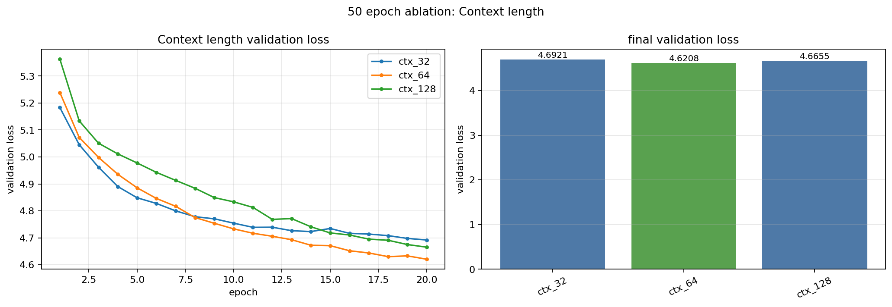

결과 파일:

- `checkpoints/ablation50/ablation50_context_length_20260603_200105_129.json`
- `figures/ablation50/ablation50_context_length_20260603_200105_129.png`

| label | context_length | final train loss | final val loss | best val loss | elapsed | 메모 |
|---|---:|---:|---:|---:|---:|---|
| ctx_32 | 32 | 4.7139 | 4.6921 | 4.6921 | 2.6분 | 짧은 후보 |
| ctx_64 | 64 | 4.5998 | 4.6208 | 4.6208 | 1.3분 | 세 후보 중 가장 좋음 |
| ctx_128 | 128 | 4.5933 | 4.6655 | 4.6655 | 0.7분 | `64`보다 나쁨 |

해석:

- `64`가 `32`, `128`보다 낮은 validation loss를 보였다.
- 오버라이드 적용 전 실험과 달리, 이전 best 조합을 적용한 상태에서는 너무 짧은 `32`보다 `64`가 더 좋았다.
- 따라서 다음에는 `64` 주변을 더 세밀하게 확인하기로 했다.

### 64 주변 세밀 비교

`64`가 가장 좋았기 때문에 주변 값인 `48`, `64`, `80`을 `epochs=20`으로 비교했다. 이 실험에서는 `80`이 가장 낮은 validation loss를 보였다.

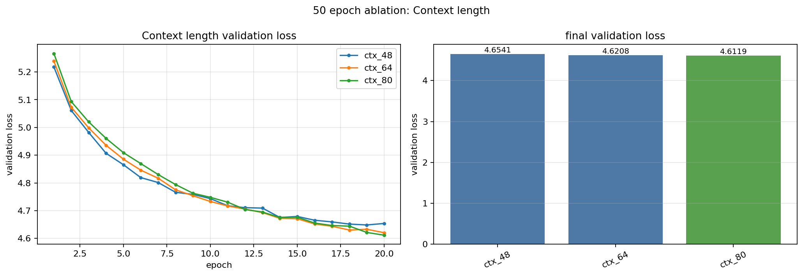

결과 파일:

- `checkpoints/ablation50/ablation50_context_length_20260603_200728_959.json`
- `figures/ablation50/ablation50_context_length_20260603_200728_959.png`

| label | context_length | final train loss | final val loss | best val loss | elapsed | 메모 |
|---|---:|---:|---:|---:|---:|---|
| ctx_48 | 48 | 4.6461 | 4.6541 | 4.6488 | 1.8분 | `64`보다 나쁨 |
| ctx_64 | 64 | 4.5998 | 4.6208 | 4.6208 | 1.4분 | 이전 best 후보 |
| ctx_80 | 80 | 4.5862 | 4.6119 | 4.6119 | 1.1분 | 가장 좋은 후보 |

해석:

- `48`은 `64`보다 나빠서 너무 짧은 쪽은 아닌 것으로 보인다.
- `80`이 `64`보다 더 낮은 validation loss를 보여서 좋은 지점이 `64`보다 약간 긴 쪽으로 이동했다.
- 따라서 `80` 위쪽도 확인할 필요가 생겼다.

### 80 위쪽 확인

`80`이 가장 좋았기 때문에 그보다 긴 `96`, `112`를 함께 비교했다. 이 결과에서도 `80`이 가장 좋았다.

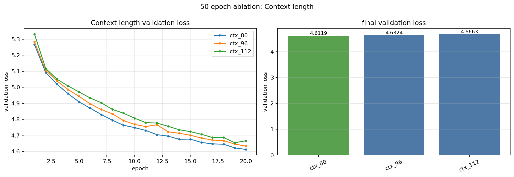

결과 파일:

- `checkpoints/ablation50/ablation50_context_length_20260603_201332_019.json`
- `figures/ablation50/ablation50_context_length_20260603_201332_019.png`

| label | context_length | final train loss | final val loss | best val loss | elapsed | 메모 |
|---|---:|---:|---:|---:|---:|---|
| ctx_80 | 80 | 4.5862 | 4.6119 | 4.6119 | 1.1분 | 가장 좋은 후보 유지 |
| ctx_96 | 96 | 4.5885 | 4.6324 | 4.6324 | 0.9분 | `80`보다 나쁨 |
| ctx_112 | 112 | 4.5914 | 4.6663 | 4.6539 | 0.8분 | 더 나쁨 |

해석:

- `80`보다 더 긴 `96`, `112`는 validation loss가 높아졌다.
- 현재 후보군에서는 `80` 근처가 가장 좋은 지점으로 보인다.
- 빠른 탐색은 `epochs=20`으로 진행했기 때문에, 마지막에는 `epochs=50`으로 다시 확인해야 한다.

### 50 epoch 재확인

빠른 탐색에서 `80`이 가장 좋아 보였으므로, 마지막으로 `64`, `80`, `96`을 `epochs=50`으로 다시 학습했다. 50 epoch에서도 `80`이 가장 낮은 validation loss를 보였다.

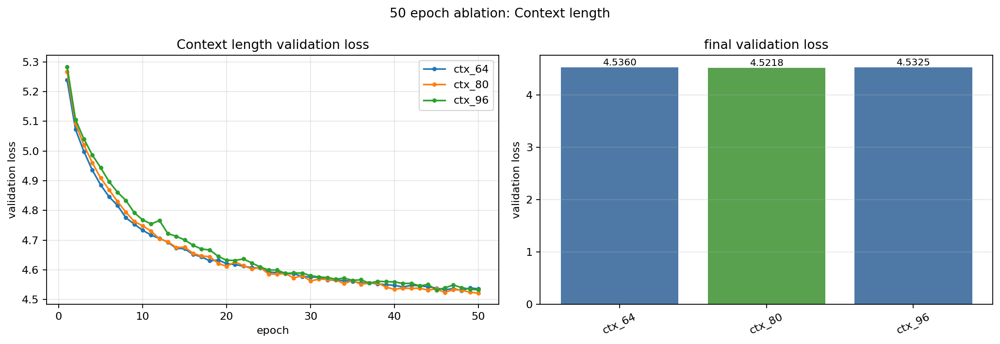

결과 파일:

- `checkpoints/ablation50/ablation50_context_length_20260603_201721_327.json`
- `figures/ablation50/ablation50_context_length_20260603_201721_327.png`

| label | context_length | final train loss | final val loss | best val loss | elapsed | 메모 |
|---|---:|---:|---:|---:|---:|---|
| ctx_64 | 64 | 4.5050 | 4.5360 | 4.5307 | 3.4분 | `80`보다 나쁨 |
| ctx_80 | 80 | 4.4730 | 4.5218 | 4.5218 | 2.7분 | 50 epoch에서도 가장 좋음 |
| ctx_96 | 96 | 4.4554 | 4.5325 | 4.5320 | 2.3분 | train loss는 낮지만 val loss는 `80`보다 높음 |

해석:

- `ctx_80`이 final val loss 기준으로 가장 좋다.
- `ctx_96`은 train loss가 가장 낮지만 validation loss는 `80`보다 높다. 더 긴 context가 train 데이터에는 더 맞춰질 수 있지만 validation 성능은 더 좋아지지 않았다.
- `epochs=20`에서 찾은 후보가 `epochs=50`에서도 유지되었으므로, `context_length=80`을 현재 best로 기록한다.

## Context length 현재 결론

현재 최적 후보 조합에서 context length만 바꿔 본 결과, 가장 좋은 값은 `context_length=80`이다.

```text
best so far:
drop_rate = 0.14
learning_rate = 5e-3
optimizer = AdamW
weight_decay = 0.06
context_length = 80

final train loss = 4.4730
final val loss = 4.5218
best val loss = 4.5218
```

이번 실험은 이전 best 값을 모두 오버라이드한 상태에서 진행했다. 처음에는 시간을 줄이기 위해 `epochs=20`으로 `32 / 64 / 128`, `48 / 64 / 80`, `80 / 96 / 112`를 빠르게 비교했고, 여기서 `80`이 가장 좋아 보였다. 마지막으로 `epochs=50`에서 `64 / 80 / 96`을 다시 돌렸을 때도 `80`이 가장 낮은 validation loss를 보였다.

```text
confirmed best: context_length = 80
confirmed with epochs = 50
```

앞으로는 다음 하이퍼파라미터 실험을 `context_length=80` 기준으로 진행한다. 빠른 후보 탐색이 필요할 때는 epoch를 줄이고, 최종 후보는 다시 50 epoch로 확인하는 방식이 좋다.

## Vocab size가 하는 일

`vocab_size`는 tokenizer가 사용할 수 있는 토큰 종류의 개수다. 이 값은 모델의 입력 토큰화 방식과 embedding/output layer 크기에 직접 영향을 준다.

이번 프로젝트의 tokenizer는 UTF-8 byte-level BPE다. 그래서 특수 토큰 4개와 byte 토큰 256개가 기본으로 필요하다.

```text
minimum vocab_size = 4 + 256 = 260
```

따라서 `vocab_size=100`처럼 260보다 작은 값은 사용할 수 없다. 이런 값을 쓰면 tokenizer는 100 이상의 byte token ID를 만들 수 있는데, 모델 embedding 크기는 100밖에 없어서 CUDA device-side assert 같은 오류가 날 수 있다.

값이 작으면 문장이 더 잘게 쪼개진다.

```text
vocab_size = 300
기본 byte token에 가까운 작은 vocabulary
```

값이 적당하면 자주 나오는 byte pair나 subword를 조금 더 큰 단위로 묶을 수 있다.

```text
vocab_size = 500 ~ 1000
더 많은 merge token을 사용함
```

값이 너무 크면 tokenizer는 더 많은 표현을 토큰 하나로 만들 수 있지만, 데이터가 작으면 각 토큰이 충분히 자주 학습되지 않을 수 있다. 또한 vocab size가 커지면 token embedding과 output layer도 커진다.

```text
vocab_size = 2000, 4000
표현력은 커지지만 현재 데이터/모델에서는 loss가 더 높았음
```

주의할 점은 vocab size를 바꾸면 tokenizer 자체가 바뀐다는 것이다. 같은 문장도 토큰 개수와 토큰 단위가 달라지므로 loss 숫자를 다른 하이퍼파라미터처럼 완전히 동일한 기준으로만 보기는 어렵다. 그래도 같은 데이터, 같은 학습 조건에서 validation loss와 그래프를 함께 보면 현재 설정에서 어떤 vocab size가 더 잘 맞는지 판단할 수 있다.

## Vocab size 실험 결과

이번 실험은 앞에서 찾은 현재 최적 후보를 기준으로 진행했다.

```text
drop_rate = 0.14
learning_rate = 5e-3
optimizer = AdamW
weight_decay = 0.06
context_length = 80
```

기본 `BASE_CONFIG_50` 자체는 바꾸지 않고, vocab size 실험을 실행할 때만 위 값을 `base_overrides`로 적용했다.

실험 전 가설:

- vocab size가 너무 작으면 문장이 너무 잘게 쪼개져 한 context 안에 담기는 실제 의미 범위가 줄어들 수 있다.
- vocab size가 너무 크면 현재 데이터에서 각 토큰을 충분히 학습하기 어려워 validation loss가 나빠질 수 있다.
- 이 데이터와 작은 GPT 설정에서는 너무 큰 vocab보다 작은 vocab이 더 안정적일 수 있다.
- vocab size는 tokenizer를 바꾸는 실험이므로, loss 숫자와 함께 토큰화 단위가 달라진다는 점을 같이 고려한다.

### 넓은 범위 확인

처음에는 `1000`, `2000`, `3000`을 `epochs=20`으로 비교했다. 이 실험에서 가장 작은 `1000`이 가장 낮은 validation loss를 보였다.

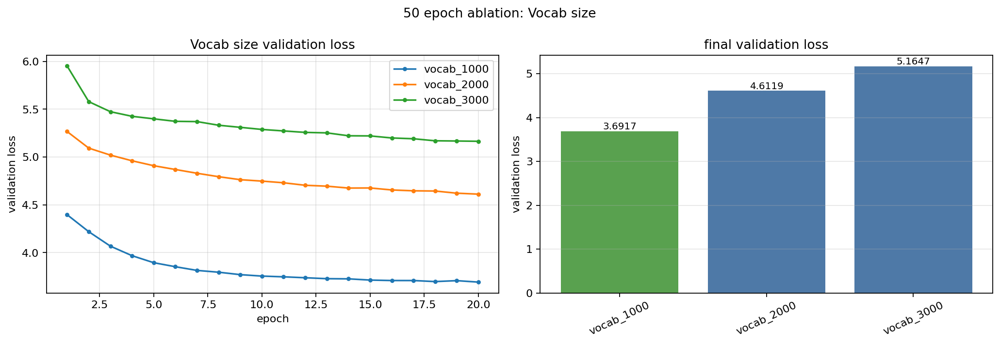

결과 파일:

- `checkpoints/ablation50/ablation50_vocab_size_20260603_203214_066.json`
- `figures/ablation50/ablation50_vocab_size_20260603_203214_066.png`

| label | vocab_size | final train loss | final val loss | best val loss | elapsed | 메모 |
|---|---:|---:|---:|---:|---:|---|
| vocab_1000 | 1000 | 3.7666 | 3.6917 | 3.6917 | 1.3분 | 가장 좋음 |
| vocab_2000 | 2000 | 4.5862 | 4.6119 | 4.6119 | 1.0분 | 기본값보다 큰 loss |
| vocab_3000 | 3000 | 4.9801 | 5.1647 | 5.1647 | 0.9분 | 가장 나쁨 |

해석:

- vocab size가 커질수록 validation loss가 높아졌다.
- 현재 설정에서는 큰 vocab보다 작은 vocab이 더 좋아 보인다.
- 따라서 `1000`보다 더 작은 vocab size를 확인할 필요가 생겼다.

### 작은 vocab size 확인

다음으로 `500`, `1000`, `1500`을 비교했다. 이 결과에서는 `500`이 가장 좋았다.

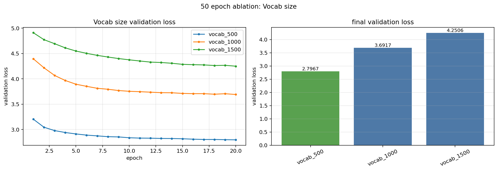

결과 파일:

- `checkpoints/ablation50/ablation50_vocab_size_20260603_205900_314.json`
- `figures/ablation50/ablation50_vocab_size_20260603_205900_314.png`

| label | vocab_size | final train loss | final val loss | best val loss | elapsed | 메모 |
|---|---:|---:|---:|---:|---:|---|
| vocab_500 | 500 | 2.8997 | 2.7967 | 2.7967 | 1.8분 | 가장 좋음 |
| vocab_1000 | 1000 | 3.7666 | 3.6917 | 3.6917 | 1.3분 | `500`보다 나쁨 |
| vocab_1500 | 1500 | 4.2690 | 4.2506 | 4.2506 | 1.1분 | 더 나쁨 |

해석:

- `500`이 `1000`, `1500`보다 훨씬 낮은 validation loss를 보였다.
- 좋은 방향이 더 작은 vocab size 쪽으로 계속 이동했다.
- byte-level BPE의 최소 가능 값이 260이므로, 그 근처인 `300`대 vocab을 확인하기로 했다.

### 300 근처 확인

`300`, `400`, `500`을 비교했을 때 `300`이 가장 좋았다.


결과 파일:

- `checkpoints/ablation50/ablation50_vocab_size_20260603_211455_968.json`
- `figures/ablation50/ablation50_vocab_size_20260603_211455_968.png`

| label | vocab_size | final train loss | final val loss | best val loss | elapsed | 메모 |
|---|---:|---:|---:|---:|---:|---|
| vocab_300 | 300 | 2.0140 | 1.9288 | 1.9274 | 2.7분 | 가장 좋음 |
| vocab_400 | 400 | 2.5824 | 2.4838 | 2.4838 | 2.0분 | `300`보다 나쁨 |
| vocab_500 | 500 | 2.8997 | 2.7967 | 2.7967 | 1.8분 | 더 나쁨 |

해석:

- `300`이 `400`, `500`보다 validation loss가 낮았다.
- 최소 가능 vocab size인 260에 가까운 작은 vocabulary가 현재 데이터와 모델에 잘 맞는 것으로 보인다.
- 더 세밀하게 `300` 바로 위쪽을 확인할 필요가 있다.

### 300 주변 재확인

`300`, `305`, `310`을 `epochs=50`으로 다시 비교했다. 50 epoch에서도 `300`이 가장 낮은 validation loss를 보였다.

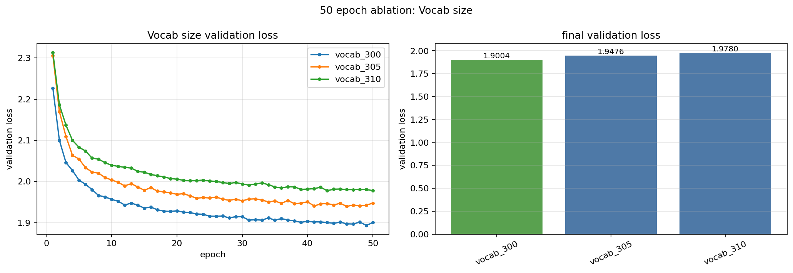

결과 파일:

- `checkpoints/ablation50/ablation50_vocab_size_20260603_220128_985.json`
- `figures/ablation50/ablation50_vocab_size_20260603_220128_985.png`

| label | vocab_size | final train loss | final val loss | best val loss | best epoch | elapsed | 메모 |
|---|---:|---:|---:|---:|---:|---:|---|
| vocab_300 | 300 | 1.9807 | 1.9004 | 1.8933 | 49 | 7.1분 | 50 epoch에서도 가장 좋음 |
| vocab_305 | 305 | 2.0195 | 1.9476 | 1.9395 | 46 | 6.8분 | `300`보다 나쁨 |
| vocab_310 | 310 | 2.0615 | 1.9780 | 1.9776 | 43 | 6.6분 | 더 나쁨 |

해석:

- `300`이 final val loss와 best val loss 모두 가장 낮다.
- `305`, `310`처럼 조금만 늘려도 validation loss가 올라갔다.
- 따라서 현재 실험에서는 최소 vocabulary에 가까운 `300`이 가장 좋은 후보로 보인다.

## Vocab size 현재 결론

현재 최적 후보 조합에서 vocab size만 바꿔 본 결과, 가장 좋은 값은 `vocab_size=300`이다.

```text
best so far:
drop_rate = 0.14
learning_rate = 5e-3
optimizer = AdamW
weight_decay = 0.06
context_length = 80
vocab_size = 300

final train loss = 1.9807
final val loss = 1.9004
best val loss = 1.8933
```

다만 vocab size 실험은 tokenizer 자체가 바뀌므로, loss scale이 다른 실험보다 크게 달라질 수 있다. `vocab_size=300`은 현재 validation loss 기준으로 가장 좋지만, 최종 보고에서는 "현재 데이터와 tokenizer 조건에서 가장 낮은 loss를 보인 값"으로 해석한다.

앞으로는 다음 하이퍼파라미터 실험을 `vocab_size=300` 기준으로 진행한다.

```text
drop_rate = 0.14
learning_rate = 5e-3
optimizer = AdamW
weight_decay = 0.06
context_length = 80
vocab_size = 300
```

## Embedding dimension이 하는 일

`emb_dim`은 각 토큰을 몇 차원의 벡터로 표현할지 정하는 값이다. tokenizer가 문장을 token ID로 바꾸면, 모델은 그 ID를 바로 계산하는 것이 아니라 embedding table에서 벡터로 바꿔서 사용한다.

```text
token id -> embedding vector
```

예를 들어 `emb_dim=128`이면 토큰 하나가 128차원 벡터로 표현되고, `emb_dim=320`이면 토큰 하나가 320차원 벡터로 표현된다. 이 값은 token embedding뿐 아니라 transformer block 내부의 hidden size에도 연결되므로, 모델의 표현력과 파라미터 수에 직접 영향을 준다.

값이 작으면 모델이 가볍고 빠르지만 표현력이 부족할 수 있다.

```text
emb_dim = 64, 128
계산은 가볍지만 현재 실험에서는 validation loss가 더 높았음
```

값이 적당히 커지면 토큰과 문맥 정보를 더 풍부하게 표현할 수 있다.

```text
emb_dim = 256, 320
현재 설정에서는 loss가 더 낮아지는 방향을 보였음
```

하지만 값이 너무 커지면 파라미터 수가 늘고, 데이터가 충분하지 않을 때는 과적합이나 불안정한 학습으로 이어질 수 있다. 학습 시간과 메모리 사용량도 함께 증가한다.

```text
emb_dim이 커질수록
표현력 증가 + 계산량 증가 + 과적합 가능성 증가
```

따라서 embedding dimension 실험은 "현재 데이터와 모델 크기에서 어느 정도의 표현력이 필요한가"를 찾는 과정이다. loss만 보는 것이 아니라 그래프가 안정적으로 내려가는지, 학습 시간이 너무 커지지 않는지도 함께 봐야 한다.

## Embedding dimension 실험 결과

이번 실험은 앞에서 찾은 현재 최적 후보를 기준으로 진행했다.

```text
drop_rate = 0.14
learning_rate = 5e-3
optimizer = AdamW
weight_decay = 0.06
context_length = 80
vocab_size = 300
```

기본 `BASE_CONFIG_50` 자체는 바꾸지 않고, embedding dimension 실험을 실행할 때만 위 값을 `base_overrides`로 적용했다.

실험 전 가설:

- `emb_dim`이 너무 작으면 토큰과 문맥을 표현할 공간이 부족해서 validation loss가 높을 수 있다.
- `emb_dim`을 키우면 모델 표현력이 좋아져 loss가 내려갈 수 있다.
- 다만 너무 큰 `emb_dim`은 파라미터 수와 계산량을 늘리고, 작은 데이터에서는 과적합이나 불안정한 그래프를 만들 수 있다.
- 따라서 처음에는 넓은 범위로 확인하고, 좋아 보이는 값 주변을 좁혀서 다시 비교한다.

### 넓은 범위 확인

처음에는 `64`, `128`, `256`을 `epochs=20`으로 비교했다. 이 실험에서는 `256`이 가장 낮은 validation loss를 보였다.

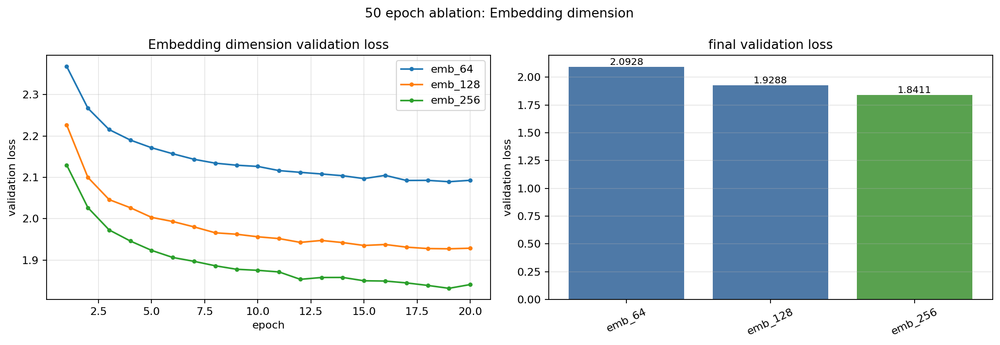

결과 파일:

- `checkpoints/ablation50/ablation50_emb_dim_20260603_222601_515.json`
- `figures/ablation50/ablation50_emb_dim_20260603_222601_515.png`

| label | emb_dim | final train loss | final val loss | best val loss | elapsed | 메모 |
|---|---:|---:|---:|---:|---:|---|
| emb_64 | 64 | 2.2084 | 2.0928 | 2.0894 | 3.2분 | 가장 작은 모델, loss가 가장 높음 |
| emb_128 | 128 | 2.0140 | 1.9288 | 1.9274 | 2.7분 | `64`보다 좋아짐 |
| emb_256 | 256 | 1.8955 | 1.8411 | 1.8319 | 3.3분 | 세 후보 중 가장 좋음 |

해석:

- `emb_dim`을 키울수록 validation loss가 내려갔다.
- `256`이 가장 좋았기 때문에, 아직 더 큰 값에서 좋아질 가능성이 남아 있었다.
- 다음에는 `256`보다 조금 작은 값과 더 큰 값을 함께 비교했다.

### 256 위쪽 확인

다음으로 `224`, `256`, `320`을 비교했다. 이 결과에서는 `320`이 가장 좋았다.


결과 파일:

- `checkpoints/ablation50/ablation50_emb_dim_20260603_223915_339.json`
- `figures/ablation50/ablation50_emb_dim_20260603_223915_339.png`

| label | emb_dim | final train loss | final val loss | best val loss | elapsed | 메모 |
|---|---:|---:|---:|---:|---:|---|
| emb_224 | 224 | 1.9065 | 1.8475 | 1.8452 | 3.1분 | `256`보다 약간 나쁨 |
| emb_256 | 256 | 1.8955 | 1.8411 | 1.8319 | 3.3분 | 이전 best 후보 |
| emb_320 | 320 | 1.8617 | 1.8215 | 1.8146 | 4.1분 | 가장 좋음 |

해석:

- `320`이 `224`, `256`보다 낮은 validation loss를 보였다.
- `emb_dim`을 256에서 320으로 키우는 것이 현재 모델에는 도움이 되었다.
- 다만 학습 시간이 늘어났기 때문에, 320 주변에서 더 세밀하게 확인할 필요가 있었다.

### 320 주변 확인

`320`이 좋아 보였기 때문에 `312`, `320`, `328`을 `epochs=20`으로 비교했다. 320 주변에서도 `320`이 가장 낮은 validation loss를 보였다.

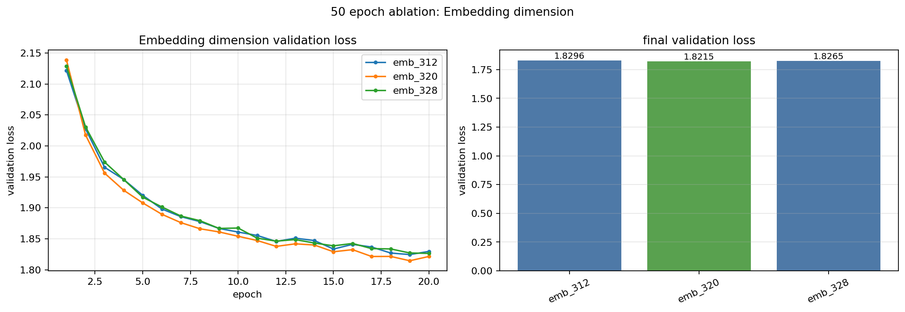

결과 파일:

- `checkpoints/ablation50/ablation50_emb_dim_20260603_225112_582.json`
- `figures/ablation50/ablation50_emb_dim_20260603_225112_582.png`

| label | emb_dim | final train loss | final val loss | best val loss | elapsed | 메모 |
|---|---:|---:|---:|---:|---:|---|
| emb_312 | 312 | 1.8706 | 1.8296 | 1.8246 | 4.1분 | `320`보다 나쁨 |
| emb_320 | 320 | 1.8617 | 1.8215 | 1.8146 | 4.1분 | 가장 좋음 |
| emb_328 | 328 | 1.8713 | 1.8265 | 1.8265 | 4.3분 | `320`보다 나쁨 |

해석:

- `312`, `328`보다 `320`이 더 좋았다.
- 단순히 embedding dimension을 더 키우는 것이 항상 좋은 것은 아니고, 현재는 `320` 근처에 좋은 지점이 있는 것으로 보인다.
- 20 epoch 결과만으로 끝내지 않고 마지막에는 50 epoch로 다시 확인했다.

### 50 epoch 재확인

마지막으로 320 주변 후보를 `epochs=50`으로 다시 비교했다. 저장된 JSON의 일부 label은 이전 이름처럼 남아 있지만, 아래 표는 실제 저장된 `config.emb_dim` 기준으로 정리했다.

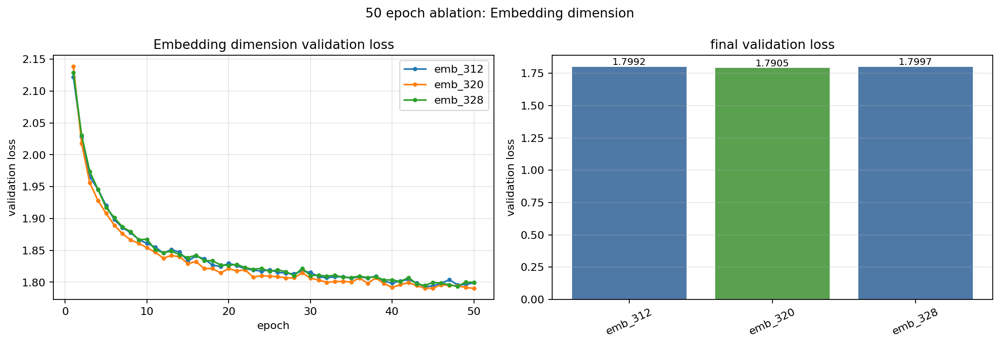

결과 파일:

- `checkpoints/ablation50/ablation50_emb_dim_20260603_230558_068.json`
- `figures/ablation50/ablation50_emb_dim_20260603_230558_068.png`

| stored label | actual emb_dim | final train loss | final val loss | best val loss | elapsed | 메모 |
|---|---:|---:|---:|---:|---:|---|
| emb_224 | 312 | 1.8316 | 1.7992 | 1.7930 | 10.3분 | label은 224지만 config 기준 312 |
| emb_320 | 320 | 1.8273 | 1.7905 | 1.7905 | 11.3분 | final val loss 기준 가장 좋음 |
| emb_256 | 328 | 1.8309 | 1.7997 | 1.7933 | 11.5분 | label은 256이지만 config 기준 328 |

해석:

- 50 epoch에서도 `emb_dim=320`이 final validation loss 기준으로 가장 좋았다.
- `312`, `328`도 best val loss는 비슷하지만, 마지막 epoch 기준 validation loss는 `320`이 가장 낮고 그래프도 비교적 안정적으로 내려갔다.
- 중간중간 validation loss가 조금 튀는 구간은 있지만, 전체 추세는 계속 내려가며 `320`이 가장 안정적인 후보로 보인다.
- `emb_dim=320`은 `256`보다 표현력이 좋아졌지만, 학습 시간은 더 길어졌다. 현재는 loss 개선을 우선해서 `320`을 best로 기록한다.

## Embedding dimension 현재 결론

현재 최적 후보 조합에서 embedding dimension만 바꿔 본 결과, 가장 좋은 값은 `emb_dim=320`이다.

```text
best so far:
drop_rate = 0.14
learning_rate = 5e-3
optimizer = AdamW
weight_decay = 0.06
context_length = 80
vocab_size = 300
emb_dim = 320

final train loss = 1.8273
final val loss = 1.7905
best val loss = 1.7905
```

앞으로는 다음 하이퍼파라미터 실험을 `emb_dim=320` 기준으로 진행한다. 다만 `emb_dim`은 모델 크기와 학습 시간을 직접 키우는 값이므로, 이후 실험에서도 loss 개선 폭과 실행 시간을 함께 기록하는 것이 좋다.

```text
drop_rate = 0.14
learning_rate = 5e-3
optimizer = AdamW
weight_decay = 0.06
context_length = 80
vocab_size = 300
emb_dim = 320
```

## 다음 실험 기록 템플릿

아래부터는 다른 하이퍼파라미터를 바꿔가며 같은 방식으로 기록한다.

### Batch size

실험 전 가설:

- 작성 예정

비교 후보:

| label | batch_size | final train loss | final val loss | best val loss | 메모 |
|---|---:|---:|---:|---:|---|
|  |  |  |  |  |  |

figure:

```markdown

```

결론:

- 작성 예정

### Number of layers

`n_layers`는 GPT 안에 TransformerBlock을 몇 층 쌓을지 정하는 값이다. 레이어가 많아질수록 모델은 더 복잡한 패턴을 표현할 수 있지만, 학습 시간과 메모리 사용량도 함께 늘어난다.

값이 작으면 모델이 가볍고 빠르다.

```text
n_layers = 1
학습과 추론은 빠르지만 표현력이 부족할 수 있음
```

값이 적당히 커지면 문맥을 더 여러 단계로 처리할 수 있어 validation loss가 좋아질 수 있다.

```text
n_layers = 4 ~ 6
현재 실험 범위에서는 레이어 수가 늘어날수록 validation loss가 낮아졌음
```

하지만 레이어가 너무 많아지면 계산량이 커지고, 작은 데이터에서는 train loss만 낮아지고 validation loss는 나빠지는 과적합이 생길 수 있다. 따라서 최종 선택은 validation loss와 학습 비용을 함께 고려해야 한다.

이번 실험은 앞에서 찾은 현재 최적 후보를 기준으로 진행했다.

```text
drop_rate = 0.14
learning_rate = 5e-3
optimizer = AdamW
weight_decay = 0.06
context_length = 80
vocab_size = 300
emb_dim = 320
```

실험 전 가설:

- 레이어가 너무 적으면 모델 표현력이 부족해서 validation loss가 높을 수 있다.
- 레이어를 늘리면 loss가 내려갈 수 있지만, 어느 지점부터는 계산 비용 대비 개선폭이 작아질 수 있다.
- 너무 깊은 모델은 학습 시간이 길어지고 과적합 가능성도 커질 수 있다.
- 현재 작은 GPT 설정에서는 `1~6` 범위에서 먼저 확인하고, loss가 계속 좋아지면 더 큰 값은 추가 실험으로 남긴다.

#### 1~3층 중간 결과

먼저 `1`, `2`, `3`층의 20 epoch 시점 loss를 확인했다. 이 구간에서는 레이어 수가 늘어날수록 train loss와 validation loss가 모두 낮아졌다.

| label | n_layers | train loss | val loss | 메모 |
|---|---:|---:|---:|---|
| layers_1 | 1 | 1.9924 | 1.9339 | 20 epoch 시점 기준 |
| layers_2 | 2 | 1.8660 | 1.8247 | 20 epoch 시점 기준 |
| layers_3 | 3 | 1.8278 | 1.7951 | 20 epoch 시점 기준 |

해석:

- `1 -> 2 -> 3`으로 갈수록 validation loss가 계속 낮아졌다.
- 현재 설정에서는 1층 모델은 표현력이 부족해 보이고, 2층보다 3층이 더 좋은 결과를 보였다.
- 따라서 4층 이상도 확인할 필요가 있었다.

#### 4~6층 50 epoch 비교

`4`, `5`, `6`층을 50 epoch 기준으로 비교했다. 최종 validation loss 기준으로 `layers_6`이 가장 낮았다.

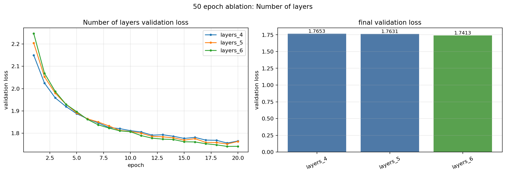

결과 파일:

- `figures/ablation50/ablation50_n_layers_20260603_235248_549.png`

| label | n_layers | final val loss | 메모 |
|---|---:|---:|---|
| layers_4 | 4 | 1.7653 | 4~6 중 가장 높음 |
| layers_5 | 5 | 1.7631 | 4층보다 조금 개선 |
| layers_6 | 6 | 1.7413 | 1~6 범위에서 가장 낮은 validation loss |

해석:

- `layers_4`, `layers_5`, `layers_6` 중에서는 `layers_6`이 가장 낮은 final validation loss를 보였다.
- 앞선 `1~3` 결과에서도 레이어 수가 늘어날수록 validation loss가 낮아졌고, `4~6` 구간에서도 같은 방향의 개선이 이어졌다.
- 따라서 현재 실험에서 나온 loss 값만 기준으로 보면 `n_layers=6`이 가장 좋은 후보가 맞다.
- 다만 레이어 수가 늘어나면 학습 시간, 추론 시간, 메모리 사용량이 증가한다. 이후 더 큰 값인 `8` 등을 실험한다면 validation loss 개선폭과 계산 비용을 함께 비교해야 한다.

## Number of layers 현재 결론

현재 `1~6` 범위의 n_layers 실험에서는 `n_layers=6`이 가장 낮은 validation loss를 보여 최적 후보로 판단된다.

```text
best so far:
drop_rate = 0.14
learning_rate = 5e-3
optimizer = AdamW
weight_decay = 0.06
context_length = 80
vocab_size = 300
emb_dim = 320
n_layers = 6

final val loss = 1.7413
```

정리하면, 성능 지표만 보면 현재 실험 범위 안에서는 `n_layers=6`이 가장 좋다. 단, 레이어가 많아질수록 계산 비용이 커지므로 최종 선택에서는 loss 개선폭과 학습 시간을 함께 고려한다.

### 그 외 메모

- dropout 최적값은 다른 설정이 바뀌면 달라질 수 있다.
- loss 값이 아주 근소하게 차이날 때는 seed를 바꿔 재실험하는 것이 좋다.
- vocab size 실험은 tokenizer가 달라져 loss scale 자체가 달라질 수 있으므로 숫자만 단순 비교하지 않는다.
