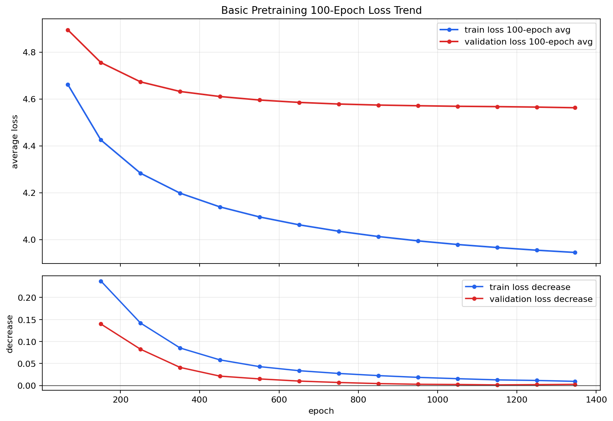
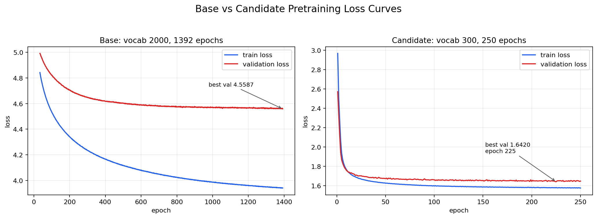
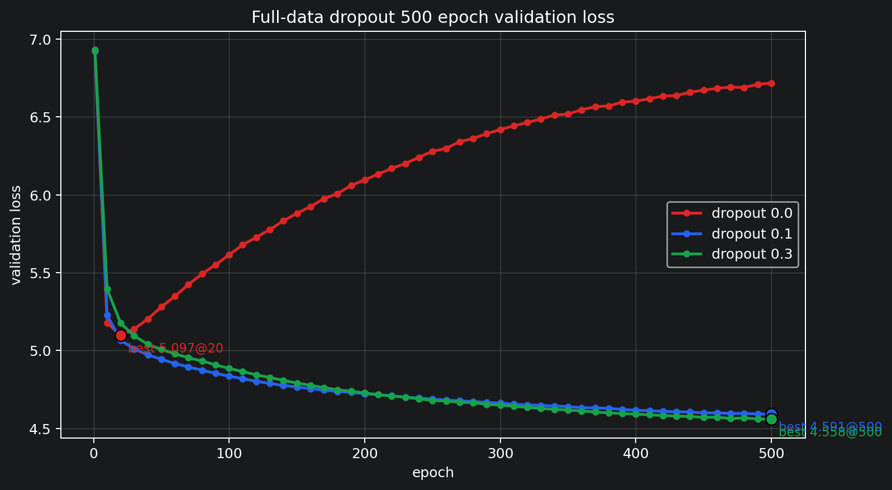
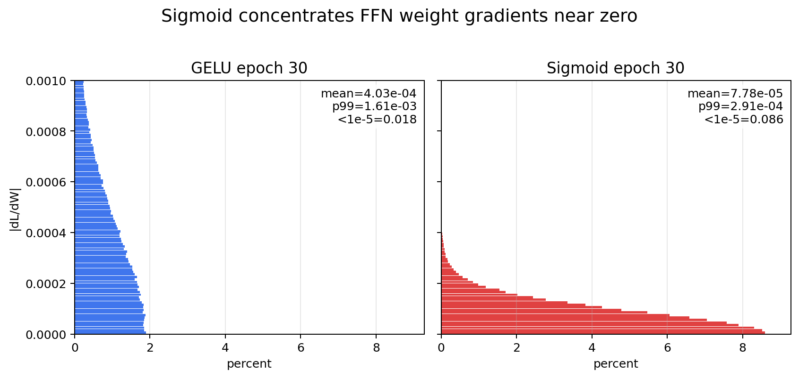
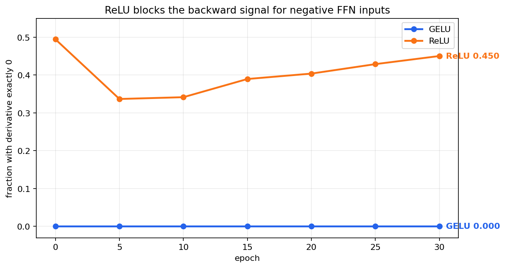

# Mini GPT 4분 발표 자료

## 0. 팀 정보

| 항목 | 내용 |
| --- | --- |
| 팀원 | 최현진, 김다애, 정영훈 |
| 담당 | 모두 |
| 프로젝트 | PyTorch 기반 Mini GPT 직접 구현 |
| 발표 기준일 | 2026-06-03 |

---

## 1. 프로젝트 요약

PyTorch만 사용해 mini GPT를 직접 구현하고, NSMC 영화 리뷰 데이터로 사전학습과 감성분류 fine-tuning을 진행했다.

| 항목 | 결과 |
| --- | --- |
| 전체 테스트 | `pytest tests -v` 통과 |
| 사전학습 | val loss 6.1680 -> 4.5587 |
| dropout 장기 비교 | 0.3이 500 epoch full-data 비교에서 best val loss 4.5582 |
| 감성분류 fine-tuning | full test accuracy 0.8517 |
| 추가 확인 | sigmoid/ReLU와 GELU의 차이를 gradient와 activation 경로로 분석 |

---

## 2. 구현 범위

| 단계 | 구현 내용 | 파일 |
| --- | --- | --- |
| Tokenizer | UTF-8 byte-level BPE | `src/bpe.py` |
| Dataset | next-token prediction용 input/target 생성 | `src/dataset.py` |
| Embedding | token embedding + position embedding | `src/embeddings.py` |
| Attention | causal multi-head self-attention | `src/attention.py` |
| GPT model | LayerNorm, GELU, FFN, TransformerBlock, GPTModel | `src/model.py` |
| Training | loss, checkpoint, generation, pretraining loop | `src/train.py` |
| Fine-tuning | NSMC 감성 분류 Dataset, classifier, train/eval | `src/finetune.py` |

```text
pytest tests -v
결과: 통과
```

---

## 3. Basic 사전학습 결과

Basic 모델은 실험의 기준점으로 사용했다. 목표는 최고 성능 탐색이 아니라, 제한 시간 안에서 전체 GPT 학습 파이프라인이 정상 동작하는 기준 모델을 만드는 것이었다.

| 항목 | 값 |
| --- | ---: |
| vocab_size | 2000 |
| context_length | 128 |
| emb_dim | 128 |
| n_heads | 4 |
| n_layers | 2 |
| batch_size | 32 |
| learning_rate | 3e-4 |

선택 기준은 학습 시간, 생성 문맥 길이, 모델 크기의 균형이었다. `emb_dim=128`, `n_layers=2`는 약 92만 파라미터 규모라 반복 실험이 가능했고, `context_length=128`은 NSMC 리뷰의 짧은 문맥과 생성 실험을 모두 감당할 수 있는 길이였다.

Basic 사전학습은 full LM 데이터 기준으로 진행했고, 최종 best checkpoint는 다음과 같다.

```text
checkpoint: checkpoints/basic_monitor_best.pt
train tokens: 900,849
validation tokens: 78,686
epoch: 1392
global_step: 306240
train_loss: 3.9407
validation_loss: 4.5587
```

---

## 4. 수렴성 확인



그래프 설명:

- 위 그래프는 100 epoch 구간별 평균 train loss와 validation loss다.
- 아래 그래프는 직전 100 epoch 구간 대비 train loss와 validation loss 감소량이다.
- 감소량이 작아질수록 같은 epoch를 더 돌렸을 때 얻는 추가 개선이 줄어든다는 뜻이다.

핵심 해석:

| 관찰 | 해석 |
| --- | --- |
| 100 epoch 평균 train loss가 4.6624에서 3.9448까지 감소 | 학습 데이터에 대한 다음 token 예측 성능이 개선 |
| 100 epoch 평균 validation loss가 4.8953에서 4.5625까지 감소 | 검증 데이터에서도 성능이 개선 |
| 마지막 구간의 train loss 감소량은 0.0095 | 후반부 추가 개선 폭이 작아짐 |
| 마지막 구간의 validation loss 감소량은 0.0028 | validation 기준에서도 수렴에 가까워짐 |

따라서 이 결과는 학습이 정상적으로 진행됐고, 후반부로 갈수록 추가 개선 폭이 작아지는 수렴 양상을 보였다고 해석했다.

추가로 팀원이 제안한 후보 파라미터 조합도 학습했다.



후보 조합:

| 항목 | 베이스 | 후보 조합 |
| --- | ---: | ---: |
| vocab_size | 2000 | 300 |
| context_length | 128 | 80 |
| emb_dim | 128 | 320 |
| n_layers | 2 | 13 |
| n_heads | 4 | 32 |
| drop_rate | 0.1 | 0.14 |
| learning_rate | 3e-4 | 5e-3 |
| weight_decay | 0 | 0.06 |
| 학습 epoch | 1392 | 250 |
| best validation loss | 4.5587 | 1.6420 |
| best epoch | 1392 | 225 |

후보 조합 best checkpoint 생성 샘플:

```text
checkpoint: checkpoints/candidate_v300_e320_l13_h32_best.pt
best epoch: 225
best validation loss: 1.6420

prompt: 영화가
영화가왜이라는걸 개봉한거지?
마지막에 한번은 찾았다 ㅋㅋ
시나리오 죽여야 하는거다
순수한 여인과 함께했던 영화.
오히려 너무나 수작이다.

prompt: 정말
정말좋은영화네요
아..음.. 신기했던 영화.. 이걸 보면서 울고싶다....
개실망 역시 무로충!
평점이 아깝다!
```

후보 조합은 베이스에서 파라미터를 조정해 만든 튜닝 모델이다. 따라서 이 그래프와 생성 샘플은 파라미터 튜닝 후 모델 출력이 어떻게 달라졌는지 보여주는 결과로 사용했다.

같은 full data 기준으로 dropout 500 epoch 비교도 진행했다.



그래프 설명:

- 세 실험 모두 train tokens 900,849와 validation tokens 78,686을 사용했다.
- dropout 0.0은 epoch 20 이후 validation loss가 다시 상승했다.
- dropout 0.1과 0.3은 500 epoch까지 validation loss가 낮아졌다.

| dropout | best val_loss | best epoch | final val_loss | 해석 |
| ---: | ---: | ---: | ---: | --- |
| 0.0 | 5.0969 | 20 | 6.7176 | 장기 학습에서 validation loss 상승 |
| 0.1 | 4.5912 | 500 | 4.5912 | 500 epoch까지 개선 |
| 0.3 | 4.5582 | 500 | 4.5582 | 가장 안정적인 validation 흐름 |

---

## 5. GELU 선택 근거

GELU는 sigmoid와 ReLU의 한계를 피하는 activation으로 해석했다.

| activation | 관찰한 문제 | GELU와의 차이 |
| --- | --- | --- |
| sigmoid | gradient가 0 근처에 더 많이 몰림 | GELU는 FFN weight gradient가 더 넓게 유지됨 |
| ReLU | `z <= 0`에서 output과 derivative가 정확히 0 | GELU는 음수 입력을 완전히 끊지 않음 |

먼저 sigmoid를 피하는 이유를 gradient로 확인했다.



그래프 설명:

- 대상은 FFN 첫 번째 Linear layer weight의 `|dL/dW|`다.
- x축 percent는 해당 gradient 크기 구간에 속한 weight 비율이다.
- sigmoid는 gradient가 0 근처에 더 많이 몰리고, GELU는 더 넓은 gradient 분포를 유지했다.

epoch 30 기준:

| 지표 | GELU | sigmoid |
| --- | ---: | ---: |
| mean abs(dL/dW) | 4.03e-04 | 7.78e-05 |
| p99 abs(dL/dW) | 1.61e-03 | 2.91e-04 | 
| abs(dL/dW) `< 1e-5` | 0.018 | 0.086 |

ReLU는 음수 구간에서 역전파 신호를 끊는 문제가 있었다.



그래프 설명:

- 그래프는 activation derivative가 정확히 0이 되는 비율이다.
- ReLU는 음수 입력 구간에서 derivative가 0이 되어 역전파 신호가 끊긴다.
- GELU는 같은 음수 구간을 완전히 0으로 자르지 않아 derivative가 0으로 끊기지 않았다.

| 지표 | GELU | ReLU | 해석 |
| --- | ---: | ---: | --- |
| `z <= 0` | 0.444 | 0.450 | 음수 입력 비율은 비슷함 |
| activation derivative `== 0` | 0.000 | 0.450 | ReLU는 음수 구간 gradient 경로도 끊음 |

---

## 6. Fine-tuning 결과 full test 기준

사전학습 checkpoint를 backbone 초기값으로 사용해 NSMC 감성 분류 fine-tuning을 진행했다.

사전학습과 fine-tuning은 서로 다른 단계다. 아래 `1392 epoch`는 GPT 사전학습이고, 감성분류는 별도 label 데이터로 fine-tuning했다.

### 사전학습 checkpoint

| 항목 | 값 |
| --- | ---: |
| checkpoint | `checkpoints/basic_monitor_best.pt` |
| pretraining data | `nsmc_lm_train.txt` full |
| pretraining train tokens | 900,849 |
| pretraining epoch | 1392 |

### 감성분류 fine-tuning full data

| 항목 | 값 |
| --- | ---: |
| train samples | 137,996 |
| validation samples | 11,999 |
| test samples | 49,997 |
| max_length | 128 |
| batch_size | 64 |
| learning_rate | 1e-4 |
| backbone update | 전체 backbone 학습 |
| fine-tuning stop epoch | 49 |
| early stopping 기준 | validation accuracy 20 epoch 개선 없음 |
| best validation epoch | 29 |
| tested checkpoint | `checkpoints/finetune_full_test_best_classifier.pt` |

| split | loss | accuracy |
| --- | ---: | ---: |
| validation | 0.4002 | 0.8507 |
| test | 0.3936 | 0.8517 |

---

## 7. 결론

1. BPE tokenizer부터 GPT model, pretraining loop, fine-tuning module까지 직접 구현했다.
2. Basic 모델은 validation loss를 6.1680에서 4.5587까지 낮췄다.
3. 후반부에는 validation loss 감소폭이 작아져 수렴에 가까운 흐름을 보였다.
4. GELU를 유지한 이유를 sigmoid gradient 문제와 비교해 확인했다.
5. fine-tuning은 full test 기준 test accuracy 0.8517을 기록했다.
6. 남은 개선점은 좋은 ablation 후보를 조합해 다시 학습하고, fine-tuning baseline을 추가하는 것이다.
