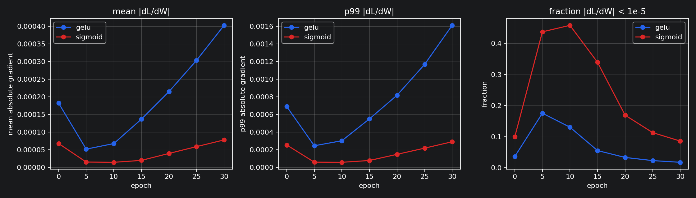
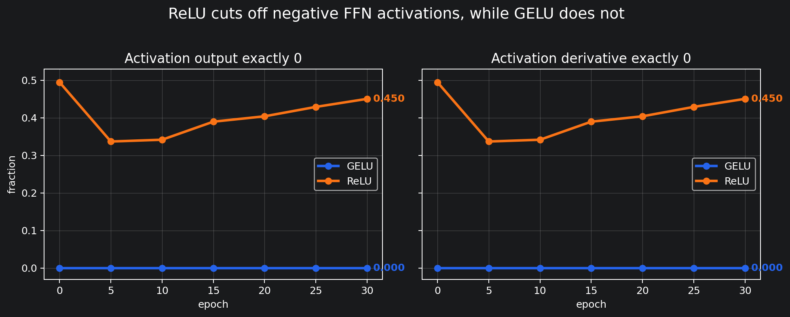

# Mini GPT 발표용 요약 보고서

## 0. 팀 정보

| 항목 | 내용 |
| --- | --- |
| 팀원 | 최현진, 김다애, 정영훈 |
| 담당자 | 모두 |
| 프로젝트 | PyTorch 기반 Mini GPT 직접 구현 |
| 발표 기준일 | 2026-06-03 |

---

## 1. 발표 핵심 주장

이번 프로젝트에서 강조할 내용은 세 가지다.

| 주장 | 근거 |
| --- | --- |
| GPT 구성 요소를 직접 구현했다 | BPE tokenizer, Dataset, Embedding, Attention, GPTModel, train loop, finetune module 구현 |
| 사전학습이 실제로 진행되었다 | Basic 모델 validation loss가 6.1680에서 4.5587까지 감소 |
| 과제에서 쓰는 설계 선택을 실험으로 되짚었다 | activation, dropout, learning rate 등 ablation과 gradient 분석 수행 |

발표에서는 모든 실험을 설명하기보다 다음 흐름으로 진행한다.

1. 무엇을 구현했는가
2. Basic 모델이 실제로 학습되었는가
3. 수렴과 과적합을 어떻게 해석했는가
4. GELU를 쓴 이유를 어떻게 확인했는가
5. Fine-tuning까지 이어졌는가

---

## 2. 구현 범위

| 단계 | 구현 내용 | 파일 |
| --- | --- | --- |
| Tokenizer | UTF-8 byte-level BPE | `src/bpe.py` |
| Dataset | next-token prediction용 input/target 생성 | `src/dataset.py` |
| Embedding | token embedding + position embedding | `src/embeddings.py` |
| Attention | causal multi-head self-attention | `src/attention.py` |
| GPT model | LayerNorm, GELU, FFN, TransformerBlock, GPTModel | `src/model.py` |
| Training | loss, checkpoint, generation, pretraining loop | `src/train.py` |
| Fine-tuning | NSMC 감성 분류 Dataset, classifier, train/eval | `src/finetune.py` |

전체 단위 테스트와 통합 테스트를 통과했다.

```text
pytest tests -v
결과: 통과
```

---

## 3. Basic 사전학습 결과

Basic 모델 설정은 사전학습의 기준점으로 사용했다.

| 항목 | 값 |
| --- | ---: |
| vocab_size | 2000 |
| context_length | 128 |
| emb_dim | 128 |
| n_heads | 4 |
| n_layers | 2 |
| batch_size | 32 |
| learning_rate | 3e-4 |
| parameter count | 924,416 |

초기 Basic full 학습은 3 epoch까지 진행했다.

| 항목 | 값 |
| --- | ---: |
| train tokens | 900,849 |
| validation tokens | 78,686 |
| train batches | 220 |
| validation batches | 20 |
| final val_loss | 6.1680 |
| elapsed | 1097.9초 |

이후 같은 설정으로 이어 학습했고, 최종 best checkpoint는 다음과 같다.

```text
checkpoint: checkpoints/basic_monitor_best.pt
epoch: 1392
global_step: 306240
train_loss: 3.9407
validation_loss: 4.5587
```

해석:

> validation loss가 6.1680에서 4.5587까지 감소했으므로, 학습 데이터뿐 아니라 validation 데이터에서도 다음 token 예측이 개선되었다.

---

## 4. 수렴성과 과적합 해석


100 epoch 구간 평균으로 보면 후반부 개선 폭이 크게 줄었다.

| epoch 구간 | 평균 val_loss | 직전 구간 대비 평균 val 감소량 |
| ---: | ---: | ---: |
| 100-199 | 4.7566 | - |
| 200-299 | 4.6736 | 0.0831 |
| 900-999 | 4.5711 | 0.0029 |
| 1100-1199 | 4.5673 | 0.0014 |
| 1300-1392 | 4.5625 | 0.0028 |

과적합 해석은 조심해서 말했다.

| 관찰 | 해석 |
| --- | --- |
| train_loss 3.9407 < val_loss 4.5587 | 학습 데이터에 더 잘 맞춰진 신호는 있음 |
| validation loss도 계속 감소 | 전형적인 과적합처럼 validation loss가 상승한 것은 아님 |
| 후반부 감소폭이 0.002 안팎 | 더 많은 epoch보다 모델 크기, learning rate, regularization 조정이 더 중요해진 상태 |

발표 문장:

> 과적합이 전혀 없다고 말하지는 않았다. train/validation loss 차이는 있지만 validation loss도 계속 감소했기 때문에, 심한 과적합보다는 후반부 개선 폭이 작아진 수렴 상태로 해석했다.

---

## 5. Activation 실험

50 epoch ablation 결과는 다음과 같다.

| activation | final val_loss | best val_loss |
| --- | ---: | ---: |
| SiLU | 4.9352 | 4.9352 |
| GELU | 4.9428 | 4.9428 |
| ReLU | 4.9557 | 4.9557 |
| Sigmoid | 4.9773 | 4.9773 |

SiLU가 가장 낮고 GELU가 근소하게 뒤따랐다. 두 값의 차이는 0.0076이고 단일 seed 결과이므로, 이 결과만으로 SiLU가 항상 더 낫다고 결론내리지 않았다. 과제의 GPT FFN 구조를 기준으로 GELU를 유지하고, sigmoid와 ReLU를 피한 이유를 추가로 확인했다.

### 5.1 Sigmoid를 피한 근거

sigmoid는 입력 절댓값이 커질수록 미분값이 작아진다. 따라서 FFN 첫 번째 Linear layer의 weight gradient `dL/dW`가 얼마나 작아지는지 확인했다.



epoch 30 기준:

| 지표 | GELU | sigmoid | 해석 |
| --- | ---: | ---: | --- |
| mean abs(dL/dW) | 4.03e-04 | 7.78e-05 | GELU가 5.17배 큼 |
| p99 abs(dL/dW) | 1.61e-03 | 2.91e-04 | GELU가 5.53배 큼 |
| abs(dL/dW) `< 1e-5` | 0.018 | 0.086 | sigmoid가 0 근처 gradient를 더 많이 만듦 |

발표 문장:

> sigmoid는 validation loss도 가장 높았고, FFN weight로 전달되는 gradient도 GELU보다 훨씬 작게 몰렸다. 그래서 GPT FFN에서는 sigmoid를 쓰지 않는 이유를 실험적으로 확인할 수 있었다.

### 5.2 ReLU를 피한 근거

ReLU는 `z <= 0`에서 output과 derivative가 정확히 0이 된다. 따라서 ReLU는 `dL/dW` 평균보다 activation output과 derivative가 0이 되는 비율을 보는 것이 더 직접적이다.



epoch 30 기준:

| 지표 | GELU | ReLU | 해석 |
| --- | ---: | ---: | --- |
| `z <= 0` | 0.444 | 0.450 | pre-activation 음수 비율은 비슷함 |
| activation output `== 0` | 0.000 | 0.450 | ReLU는 음수 구간의 출력을 끊음 |
| activation derivative `== 0` | 0.000 | 0.450 | ReLU는 음수 구간의 gradient 경로도 끊음 |
| final val_loss | 6.7687 | 6.7906 | 같은 소규모 비교에서 GELU가 조금 낮음 |

발표 문장:

> GELU와 ReLU 모두 음수 z 비율은 비슷했지만, ReLU만 그 구간을 output 0, derivative 0으로 완전히 끊었다. GELU는 음수 입력도 정확히 0으로 자르지 않기 때문에 gradient 경로가 완전히 끊기지 않았다.

---

## 6. Ablation에서 얻은 설정별 해석

발표에서는 모든 ablation을 설명하지 않고 질문 대응용으로 둔다. 핵심만 정리하면 다음과 같다.

| 항목 | 관찰 | 발표용 해석 |
| --- | --- | --- |
| dropout | 0.1이 가장 낮고, 0.0은 epoch 20 이후 val_loss 상승 | dropout 0.1 유지 근거 |
| learning_rate | 1e-3이 50 epoch에서는 가장 낮음 | 다음 조합 실험 후보, 장기 안정성은 추가 확인 필요 |
| context_length | 64가 50 epoch loss는 가장 낮음 | 짧은 문맥이 빠르게 학습됐지만, Basic은 긴 생성 문맥을 위해 128 유지 |
| emb_dim | 256이 best val_loss는 낮음 | 표현력 증가 효과가 있으나 epoch 27 이후 상승 |
| n_layers | 4층이 가장 낮음 | 성능은 좋아졌지만 실행 시간도 증가 |
| vocab_size | 1000 loss가 낮게 보임 | vocab_size는 token 수와 class 수가 달라져 loss 직접 비교 금지 |

보고서에서 특히 방어해야 할 점:

> Basic 값은 최적값이 아니라 기준 실험이다. ablation 결과는 다음 조합 실험 후보를 찾기 위한 자료로 해석했다.

---

## 7. Fine-tuning 결과

사전학습 checkpoint를 backbone 초기값으로 사용해 NSMC 감성 분류 fine-tuning을 진행했다.

| 항목 | 값 |
| --- | ---: |
| checkpoint | `checkpoints/basic_monitor_best.pt` |
| pretraining epoch | 1392 |
| train samples | 30,000 |
| validation samples | 6,000 |
| test samples | 6,000 |
| fine-tuning epoch | 3 |
| elapsed | 15.8초 |


| split | loss | accuracy |
| --- | ---: | ---: |
| validation | 0.4273 | 0.8003 |
| test | 0.4224 | 0.8022 |

해석:

> Fine-tuning pipeline은 subset 기준 NSMC 분류까지 정상 동작했다. 다만 random initialization 또는 frozen backbone baseline과 비교하지 않았으므로, 이 수치만으로 사전학습 효과의 크기를 분리해 주장하지는 않았다.

---

## 8. 예상 질문과 답변

### Q1. validation loss가 accuracy인가?

아니다. 사전학습 validation loss는 validation 문장에서 정답 다음 token에 얼마나 높은 확률을 줬는지 보는 cross entropy다. accuracy는 정답을 1등으로 맞혔는지 보는 값이다. GPT 사전학습에서는 vocab 후보가 많기 때문에 loss를 중심으로 보았다.

### Q2. 1392 epoch면 과적합 아닌가?

train loss가 validation loss보다 낮으므로 과적합 신호는 있다. 하지만 validation loss도 6.1680에서 4.5587까지 계속 감소했기 때문에, validation 성능이 나빠지는 전형적인 과적합으로 보지는 않았다.

### Q3. SiLU가 GELU보다 낮은데 왜 GELU인가?

SiLU와 GELU 차이는 0.0076으로 작고 단일 seed 결과다. 과제의 GPT FFN 구조는 GELU를 기준으로 했고, 추가 분석에서 GELU는 sigmoid의 작은 gradient 문제와 ReLU의 0으로 끊기는 경로 문제를 피하는 근거를 보였다.

### Q4. vocab_size 1000 loss가 낮은데 왜 2000을 썼나?

vocab_size가 바뀌면 tokenization 단위와 예측 class 수가 같이 바뀐다. 따라서 cross entropy loss 숫자만으로 vocab_size를 직접 비교하면 안 된다. bits-per-byte, 생성 품질, token 수를 함께 봐야 한다.

### Q5. 5 epoch씩 나눠 학습하는 것과 500 epoch 한 번에 학습하는 것이 같은가?

총 학습량은 비슷하지만 optimizer state를 이어받지 않으면 달라질 수 있다. AdamW는 `exp_avg`, `exp_avg_sq`, `step` 같은 내부 상태를 사용하므로, checkpoint에는 model state뿐 아니라 optimizer state도 같이 저장해야 한다.

### Q6. fine-tuning 성능이 사전학습 덕분이라고 말할 수 있나?

이번 결과만으로는 사전학습 효과의 크기를 분리해 말할 수 없다. random initialization backbone이나 frozen backbone baseline이 없기 때문이다. 그래서 보고서에서는 fine-tuning pipeline이 동작했다는 범위로만 주장했다.

---

## 9. 발표 결론

1. BPE tokenizer부터 GPT model, pretraining loop, fine-tuning module까지 직접 구현했다.
2. Basic 모델은 validation loss를 6.1680에서 4.5587까지 낮췄다.
3. 후반부에는 validation loss 감소폭이 작아져 수렴에 가까운 흐름을 보였다.
4. sigmoid와 ReLU를 피하고 GELU를 쓰는 이유를 gradient와 activation 경로 관점에서 확인했다.
5. Fine-tuning은 subset 기준 test accuracy 0.8022를 기록했다.
6. 남은 개선점은 좋은 ablation 후보를 조합해 다시 학습하고, fine-tuning baseline을 추가하는 것이다.
