# mini GPT 구현 및 실험 보고서

## 0. 팀 정보

| 항목 | 내용 |
| --- | --- |
| 팀원 | 최현진, 김다애, 정영훈 |
| 담당자 | 모두 |
| 프로젝트 | PyTorch 기반 mini GPT 직접 구현 |
| 실험 환경 | 로컬 GPU 환경 |
| 최종 작성일 | 2026-06-02 |

---

## 1. 프로젝트 요약

이 프로젝트는 외부 pretrained model이나 pretrained tokenizer를 사용하지 않고, byte-level BPE tokenizer부터 GPT 계열 언어 모델, 사전학습 루프, 감성 분류 미세조정용 모듈까지 직접 구현하는 것을 목표로 했다.

구현은 과제에서 제시된 순서대로 진행했다.

1. 문장을 token ID로 바꾸는 tokenizer를 직접 만들었다
2. 학습 데이터를 일정한 길이의 입력과 정답으로 나누고, token ID를 벡터로 바꾸는 embedding을 구현했다
3. GPT가 미래 token을 보지 못하게 막는 causal attention을 구현했다
4. attention과 feed-forward layer를 쌓아 GPT 모델 본체를 구현했다
5. loss 계산, checkpoint 저장/불러오기, text generation, pretraining loop를 구현했다
6. NSMC 감성 분류를 위한 Dataset, classifier, train/eval 함수를 구현했다
7. 파이프라인 동작 확인 후 Basic 학습을 진행하고, hyperparameter를 하나씩 바꿔 성능 차이를 비교했다

핵심 결과는 다음과 같다.

| 항목 | 결과 |
| --- | --- |
| 구현 | tokenizer, dataset, embedding, attention, model, train, finetune 모듈 구현 완료 |
| 테스트 | `pytest tests -v` 기준 전체 테스트 통과 |
| 사전학습 | Basic 모델 validation loss가 6.1680에서 4.5587까지 감소 |
| 수렴성 | 100 epoch 구간 평균 기준, 후반부 validation loss 개선 폭이 0.002 안팎으로 축소 |
| ablation | 50 epoch 비교 실험에서 learning_rate 1e-3, context_length 64, emb_dim 256, n_layers 4, batch_size 16이 낮은 validation loss를 보임 |
| fine-tuning | subset 기준 NSMC validation accuracy 0.8003, test accuracy 0.8022 |

---

## 2. 구현 현황

| 단계 | 구현 내용 | 파일 | 담당자 |
| --- | --- | --- | --- |
| 1 | UTF-8 byte-level BPE tokenizer | `src/bpe.py` | 모두 |
| 2 | GPTDataset, create_dataloader, InputEmbedding | `src/dataset.py`, `src/embeddings.py` | 모두 |
| 3 | MultiHeadAttention, causal mask | `src/attention.py` | 모두 |
| 4 | LayerNorm, GELU, FeedForward, TransformerBlock, GPTModel, generate_text_simple | `src/model.py` | 모두 |
| 5 | calc_loss, checkpoint, generate, train_model | `src/train.py` | 모두 |
| 6 | NSMC 감성 분류 Dataset, classifier head, train/eval 함수 | `src/finetune.py` | 모두 |

---

## 3. 테스트 결과

구현 단계별 단위 테스트를 모두 통과했다.

| 실행 명령 | 결과 |
| --- | --- |
| `pytest tests/test_bpe.py -v` | 통과 |
| `pytest tests/test_dataset.py -v` | 통과 |
| `pytest tests/test_attention.py -v` | 통과 |
| `pytest tests/test_model.py -v` | 통과 |
| `pytest tests/test_train.py -v` | 통과 |
| `pytest tests/test_finetune.py -v` | 통과 |
| `pytest tests -v` | 통과 |

---

## 4. 데이터

| 항목 | 내용 |
| --- | --- |
| 원본 데이터 | NSMC |
| 원본 파일 | `data/ratings_train.txt`, `data/ratings_test.txt` |
| 사전학습 데이터 | `data/nsmc_lm_train.txt`, `data/nsmc_lm_val.txt` |
| 미세조정 데이터 | `data/nsmc_sentiment_train.jsonl`, `data/nsmc_sentiment_val.jsonl`, `data/nsmc_sentiment_test.jsonl` |
| 전처리 | 빈 리뷰 제거, label 정리, train/validation 분리 |

실험에서 확인한 주요 데이터 규모는 다음과 같다.

| 실험 | train tokens | validation tokens |
| --- | ---: | ---: |
| Basic full pretraining | 900,849 | 78,686 |

---

## 5. BPE Tokenizer

| 항목 | 내용 |
| --- | --- |
| 파일 | `src/bpe.py` |
| 방식 | UTF-8 byte-level BPE |
| 특수 토큰 ID | `<pad>=0`, `<unk>=1`, `<bos>=2`, `<eos>=3` |
| byte token ID | byte 0~255를 ID 4~259에 고정 |
| merge 기준 | 가장 자주 등장하는 pair를 새 token으로 등록 |
| 저장 방식 | bytes와 tuple을 JSON에 저장할 수 있도록 type 정보와 함께 저장 |
| 주요 vocab | `data/vocab_basic_2000.json` |

BPE는 처음에 모든 문자열을 UTF-8 byte ID로 바꾼 뒤, 학습된 merge rule을 순서대로 적용한다. 이 방식은 한글, 영어, 숫자, 기호를 별도 규칙 없이 모두 byte 단위에서 처리할 수 있다는 장점이 있다.

---

## 6. 모델 구조

Basic 실험의 기준 모델은 다음 설정을 사용했다.

| 항목 | 값 |
| --- | ---: |
| vocab_size | 2000 |
| context_length | 128 |
| emb_dim | 128 |
| n_heads | 4 |
| n_layers | 2 |
| FFN 확장 비율 | 4 |
| drop_rate | 0.1 |
| qkv_bias | False |
| parameter count | 924,416 |

구조는 다음과 같다.

```text
InputEmbedding
-> TransformerBlock x N
-> final LayerNorm
-> LM head
```

각 TransformerBlock은 pre-LayerNorm 구조를 사용했다.

```text
x = x + Attention(LayerNorm(x))
x = x + FeedForward(LayerNorm(x))
```

### 6.1 Parameter Count

Basic 모델의 전체 parameter 수는 924,416개다. 모듈별로 나누면 embedding과 LM head가 큰 비중을 차지하고, TransformerBlock 2개가 실제 문맥 처리의 중심을 맡는다.

| 모듈 | parameter 수 | 해석 |
| --- | ---: | --- |
| token + position embedding | 272,384 | token ID와 위치 ID를 128차원 벡터로 바꾸는 부분 |
| TransformerBlock x 2 | 395,776 | attention과 feed-forward로 문맥 정보를 섞는 부분 |
| final LayerNorm | 256 | 마지막 hidden state의 분포를 정리하는 부분 |
| LM head | 256,000 | hidden state를 vocab_size 2000개의 다음 token 점수로 바꾸는 부분 |
| 전체 | 924,416 | Basic 설정의 전체 학습 parameter 수 |

### 6.2 Loss 해석

사전학습 loss는 다음 token을 맞히는 cross entropy다. 모델이 정답 token에 높은 확률을 줄수록 loss가 낮아진다. 따라서 validation loss 감소는 학습 데이터가 아닌 분리된 validation 문장에서도 다음 token 예측이 개선되었다는 의미다.

다만 loss가 낮아졌다고 항상 생성 문장이 완전히 자연스러워지는 것은 아니다. 생성 품질은 sampling 방식, 반복, 문법, 도메인 표현까지 함께 봐야 한다. 그래서 본 보고서에서는 validation loss, 생성 샘플, 수렴 흐름을 함께 확인했다.

---

## 7. 사전학습 실험

본격적인 Basic 학습 전에 작은 설정에서 파이프라인 동작을 확인한 뒤, 아래 Basic 설정으로 장시간 학습을 진행했다. 이 장에서는 Basic 실험을 중심으로 정리한다.

### 7.1 Basic full 실험

Basic 실험은 최적 hyperparameter를 찾기 위한 최종 모델이 아니라, 과제 구현이 실제 학습으로 이어지는지 확인하고 이후 비교 실험의 출발점으로 삼기 위한 기준 실험이다. 학습을 완료한 뒤에는 50 epoch ablation 결과와 실제 로그를 함께 보며 설정별 차이를 정리했다. 아래 그래프에서 주황색 막대는 Basic 설정, 초록색 막대는 각 카테고리에서 가장 낮은 final validation loss를 보인 값이다. vocab_size는 loss scale이 달라지는 항목이라 이 요약 그래프에서 제외하고 8.5에서 참고 실험으로 따로 다룬다.

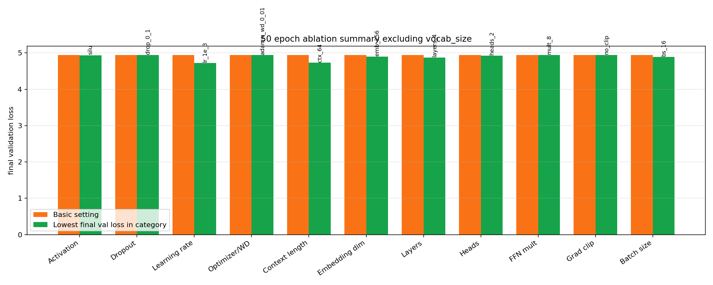

그래프의 값은 50 epoch 비교 실험의 final validation loss다. dropout 0.1은 세 후보 중 가장 낮았고, learning_rate 1e-3, context_length 64, emb_dim 256, n_layers 4, batch_size 16은 Basic 값보다 낮은 validation loss를 보였다. 이 값들은 Basic 모델을 사후에 대체했다는 뜻이 아니라, 다음 조합 실험에서 우선 확인할 후보로 해석했다. 아래 표에서 `train tokens`, `validation tokens`, `train batches`, `validation batches`, `소요 시간`은 직접 고른 hyperparameter가 아니라 선택한 데이터와 설정에서 나온 결과값이다.

| 항목 | 값 | 수치 근거 |
| --- | --- | --- |
| device | cuda | Basic 3 epoch가 1097.9초에 완료됐다. 이 시간을 기준으로 추가 학습 규모를 잡았다 |
| train tokens | 900,849 | `nsmc_lm_train.txt`를 vocab_size 2000 tokenizer로 encode한 결과다. validation tokens 78,686개 대비 약 11.5배 크기라 학습 데이터가 validation보다 충분히 많았다 |
| validation tokens | 78,686 | 전체 token 중 약 8.0%가 validation으로 사용됐다. train과 분리된 데이터에서 loss를 확인하기 위한 기준이다 |
| train batches | 220 | context_length 128, batch_size 32 기준 한 batch가 최대 4,096 token을 처리한다. 220 batch는 1 epoch당 약 900k token을 한 번 훑는 규모다 |
| validation batches | 20 | validation도 같은 batch 설정으로 20 batch가 만들어졌다. 매 평가마다 전체 validation split을 큰 비용 없이 확인할 수 있는 규모였다 |
| vocab_size | 2000 | vocab_size가 달라지면 tokenization 단위와 class 수가 함께 바뀐다. 따라서 다른 hyperparameter처럼 loss 숫자로 직접 고르지 않고, 과제 Basic 규모의 중간값인 2000을 기준값으로 사용했다 |
| context_length | 128 | context ablation 50 epoch final val_loss는 64/128/256에서 4.7285/4.9428/5.0630이었다. 64가 가장 낮았고, 128은 더 긴 생성 문맥을 쓰는 기준값으로 사용했다 |
| emb_dim | 128 | emb_dim ablation 50 epoch final val_loss는 64/128/256에서 5.0749/4.9428/4.8984였다. 256은 best val_loss 4.8284를 epoch 27에서 기록했다 |
| n_heads | 4 | n_heads ablation 50 epoch final val_loss는 2/4/8에서 4.9240/4.9428/4.9610이었다. 차이는 크지 않았고 2 heads가 가장 낮았다 |
| n_layers | 2 | n_layers ablation 50 epoch final val_loss는 1/2/4에서 4.9692/4.9428/4.8713이었다. 4층이 가장 낮았고 elapsed는 2층 104.0초, 4층 178.8초였다 |
| FFN mult | 4 | FFN mult ablation 50 epoch final val_loss는 2/4/8에서 4.9600/4.9428/4.9415였다. 4와 8의 차이는 작았다 |
| drop_rate | 0.1 | dropout ablation 50 epoch final val_loss는 0.0/0.1/0.3에서 5.2908/4.9428/5.0071이었다. dropout 0.0은 epoch 20 이후 validation loss가 다시 올라갔다 |
| optimizer | AdamW | optimizer ablation 50 epoch final val_loss는 AdamW wd0/AdamW wd0.01/Adam/SGD에서 4.9428/4.9386/4.9428/6.9292였다 |
| batch_size | 32 | batch_size ablation 50 epoch final val_loss는 16/32/64에서 4.8926/4.9428/4.9883이었다. batch 16이 가장 낮았고 elapsed는 195.4초로 가장 길었다 |
| learning_rate | 3e-4 | learning rate ablation 50 epoch final val_loss는 1e-4/3e-4/1e-3에서 5.1109/4.9428/4.7234였다. 1e-3이 가장 낮았다 |
| epoch | 3 | Basic 3 epoch 동안 train loss가 7.0618 -> 6.4957로 감소했고, step 200/400/600 validation loss도 6.9280 -> 6.3138로 감소했다. 그래서 3 epoch 후 추가 학습을 이어갈 근거가 생겼다 |
| 소요 시간 | 1097.9초 | Basic 3 epoch의 실제 실행 시간이다. 약 18.3분이었고, 이 기록을 기준으로 장시간 추가 학습을 계획했다 |
| checkpoint | `checkpoints/basic_full_final.pt` | 3 epoch 시점 final_val_loss는 6.1680이었다. 이 checkpoint에서 이어 학습한 결과 best_val_loss 4.5587까지 내려갔다 |

Basic 설정과 50 epoch ablation 결과를 비교하면 다음처럼 정리할 수 있다. 여기서 Basic 값은 최적값이라는 뜻이 아니라, 장시간 학습과 비교 실험의 기준값이다.

| 항목 | Basic 값 | 50 epoch에서 낮았던 값 | 해석 |
| --- | --- | --- | --- |
| learning_rate | 3e-4 | 1e-3 | 50 epoch에서는 1e-3이 더 빠르게 loss를 낮췄다 |
| context_length | 128 | 64 | 짧은 문맥이 loss는 낮았지만, 생성에서 더 긴 문맥을 보기 위해 Basic은 128을 유지했다 |
| emb_dim | 128 | 256 | 표현 차원을 키우면 best val_loss는 낮아졌지만 epoch 27 이후 다시 상승했다 |
| n_layers | 2 | 4 | layer 수를 늘리면 loss는 낮아졌고 실행 시간도 함께 늘었다 |
| batch_size | 32 | 16 | 작은 batch가 더 낮은 validation loss를 보였지만 실행 시간은 더 길었다 |
| drop_rate | 0.1 | 0.1 | dropout 0.0은 후반 validation loss가 상승해 0.1 유지 근거가 생겼다 |

| epoch | train_loss |
| ---: | ---: |
| 1 | 7.0618 |
| 2 | 6.8653 |
| 3 | 6.4957 |

| step | train_loss | val_loss |
| ---: | ---: | ---: |
| 200 | 6.9251 | 6.9280 |
| 400 | 6.7773 | 6.7830 |
| 600 | 6.3854 | 6.3138 |

최종 validation loss는 다음과 같았다.

```text
final_val_loss: 6.1680
```

### 7.2 추가 학습 및 수렴 관찰

Basic full 모델은 3 epoch 학습 후에도 validation loss가 계속 내려가고 있었기 때문에 추가 학습을 진행했다. 저장된 tokenizer를 재사용했기 때문에, 이후 추가 학습은 tokenizer 학습 시간 없이 GPU 학습만 수행할 수 있었다.

초기 full 학습 3 epoch에서는 final validation loss가 6.1680이었다. 이후 같은 설정으로 이어 학습을 진행했고, 최종적으로 epoch 1392에서 validation loss 4.5587까지 감소했다. 학습이 진행될수록 생성 샘플도 깨진 byte 조각이 줄고 NSMC 리뷰 도메인의 표현을 더 많이 포함했다.

최종 저장 시점의 train loss는 3.9407, validation loss는 4.5587이었다. 두 loss 사이에 차이가 있어 모델이 학습 데이터에 더 잘 맞춰진 상태를 보였지만, validation loss도 함께 감소했기 때문에 추가 학습은 실제 검증 성능 개선으로도 이어졌다.

최종 best checkpoint는 다음과 같다.

```text
checkpoints/basic_monitor_best.pt
epoch: 1392
global_step: 306240
best_val_loss: 4.5587
```

### 7.3 수렴성 분석

Validation loss는 계속 감소했지만 후반으로 갈수록 감소 속도가 크게 줄었다.

100 epoch 구간별 평균 validation loss 감소량을 정리하면 다음과 같다. endpoint 하나끼리 비교하면 특정 epoch의 흔들림이 크게 반영될 수 있으므로, 각 구간에 포함된 모든 epoch의 loss 평균을 사용했다.

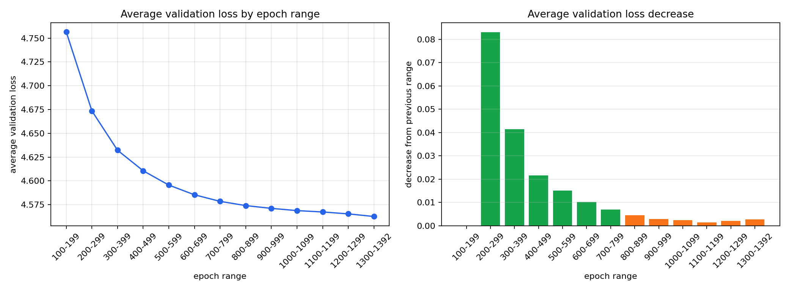

| epoch 구간 | 평균 train_loss | 평균 val_loss | 직전 구간 대비 평균 val 감소량 |
| ---: | ---: | ---: | ---: |
| 100-199 | 4.4269 | 4.7566 | - |
| 200-299 | 4.2841 | 4.6736 | 0.0831 |
| 300-399 | 4.1984 | 4.6322 | 0.0414 |
| 400-499 | 4.1399 | 4.6106 | 0.0216 |
| 500-599 | 4.0968 | 4.5955 | 0.0151 |
| 600-699 | 4.0630 | 4.5853 | 0.0102 |
| 700-799 | 4.0355 | 4.5784 | 0.0069 |
| 800-899 | 4.0130 | 4.5740 | 0.0044 |
| 900-999 | 3.9944 | 4.5711 | 0.0029 |
| 1000-1099 | 3.9788 | 4.5687 | 0.0024 |
| 1100-1199 | 3.9659 | 4.5673 | 0.0014 |
| 1200-1299 | 3.9544 | 4.5653 | 0.0020 |
| 1300-1392 | 3.9448 | 4.5625 | 0.0028 |

최종 저장 시점은 epoch 1392였고, 이때 train loss는 3.9407, validation loss는 4.5587이었다.

초기 구간인 100-199 -> 200-299에서는 평균 validation loss가 0.0831 감소했다. 반면 900-999 이후에는 구간 평균 감소량이 0.0014~0.0028 범위로 줄었다. 1300-1392 구간은 100 epoch가 아니라 93 epoch로 이루어진 마지막 partial 구간이다. endpoint 비교보다 구간 평균 비교가 더 안정적인데, 이 기준에서도 후반부 개선 폭은 초기 대비 매우 작다.

그래프는 `checkpoints/basic_monitor_history.json`의 loss 기록을 사용해 작성했다.

해당 그래프에서 train loss는 계속 감소하지만 validation loss 평균은 후반부로 갈수록 거의 평평해진다. 추가 학습 대비 개선 폭이 매우 작아진 plateau 구간으로 보았고, 이후에는 epoch를 더 늘리는 것보다 모델 크기, learning rate, regularization을 조정하는 실험이 더 중요해졌다.

### 7.4 최종 모델 생성 샘플

아래 샘플은 `checkpoints/basic_monitor_best.pt`를 load해서 생성한 결과다.

생성 설정은 다음과 같다.

```text
checkpoint: checkpoints/basic_monitor_best.pt
epoch: 1392
global_step: 306240
context_size: 128
max_new_tokens: 80
temperature: 0.8
top_k: 40
seed: 123
```

`temperature=0.8`과 `top_k=40`을 사용한 sampling 방식이라 같은 checkpoint에서도 실행할 때마다 문장은 조금 달라질 수 있다.

```text
prompt: 영화가
영화가 몇번이나 본 영화인데도 이런 영화는 보면서 다시 보니깐 돌고갔네 ㅡ,ㅡ
김탁 김지커플리 매력있더라요
마지막 장면을 둘째치고 연기파주의 연주가 매력넘좋았습니다ㅎ
감동은 최강인은 어떤 궤벨로 상영하는 듯
```

```text
prompt: 정말
정말정말너무 좋아요!
배우들의 연기는 좋으나 특별한 것을 보여주는 영화, 내용이 부여 산만하지만 영화보면서도 긴장감도 너무 지루하고, 연기가 연출도 너무 좋았고 스토리 전개도 유치하고 뻔함으로 전개도 아쉬운 부분도 있고 재미 있다는 말밖에 못하지 않을까.
이건.. 내가 15세 이상은 내 인생은 더
```

```text
prompt: 배우가
배우가 다르겠는데 이건 뭐 이뻐서 1점도아깝네..
최고에요
감동적이다.
이영화는 왜이래?
아이들이 잘 봤어요!
너무 재미없는영화도 어이없음
그냥 쓰레기같은 영화. 한국영화에서 영화관에서 보시라면 더욱 공감되네요..그저그런 비슷하네요... 이영화는 미국식사회에서
```

```text
prompt: 스토리는
스토리는 어쩔 수 없었음.
그냥 쓰레기통 역할인건 안쓰는데...ㅡㅡ;;;;;
그리고 이 영화는 정말 OOO기 영화...ㅡㅡ;;;
그 당신을 위한 영국, 한심한 그것만으로도 충분히 현실성을 주는 것이 아닌 흑백의 정체성이 너무 많아서 좋았어요. 특히 땜에님
```

짧은 초기 학습 단계에서는 깨진 byte 조각이 많았지만, 장시간 Basic 학습 후에는 NSMC 리뷰 도메인의 표현인 `평점`, `재미`, `감동`, `지루`, `영화`, `드라마` 등이 더 자주 나타났다. 다만 문장 구조가 어색한 부분, 의미가 끊기는 부분, 반복 표현은 여전히 남아 있었다. 따라서 생성 샘플은 완성된 언어 품질의 증거라기보다, validation loss 감소가 실제 도메인 표현 학습으로 일부 이어졌는지 확인하는 보조 근거로 보았다.

---

## 8. Hyperparameter Ablation

아래 실험은 Basic 설정을 기준으로 두고 한 번에 하나의 요소만 바꾸는 방식으로 진행했다. 모든 카테고리는 50 epoch로 맞춰 비교했다. 기본 비교 기준은 final validation loss다. best validation loss와 final validation loss가 크게 다른 경우는 후반부 불안정성이나 과적합 신호로 별도 해석했다.

vocab_size 실험은 tokenization 단위와 cross entropy의 클래스 수가 함께 달라지므로 다른 항목과 같은 방식으로 loss 숫자를 비교하지 않았다. 따라서 8.5의 vocab_size 결과는 hyperparameter 선택 근거가 아니라 참고 실험으로 분리했다.

개별 그래프는 각 항목 아래에 함께 배치했다. 그래프는 한눈에 경향을 보기 위한 용도이고, 표는 정확한 수치를 확인하기 위한 용도다.

### 8.1 Activation

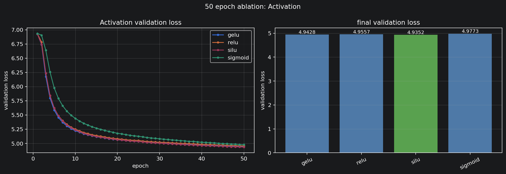

| activation | final val_loss | best val_loss | best epoch |
| --- | ---: | ---: | ---: |
| GELU | 4.9428 | 4.9428 | 50 |
| ReLU | 4.9557 | 4.9557 | 50 |
| SiLU | 4.9352 | 4.9352 | 50 |
| Sigmoid | 4.9773 | 4.9773 | 50 |

SiLU가 가장 낮았고 GELU가 근소하게 뒤따랐다. Sigmoid는 네 후보 중 가장 높았다.

### 8.2 Dropout

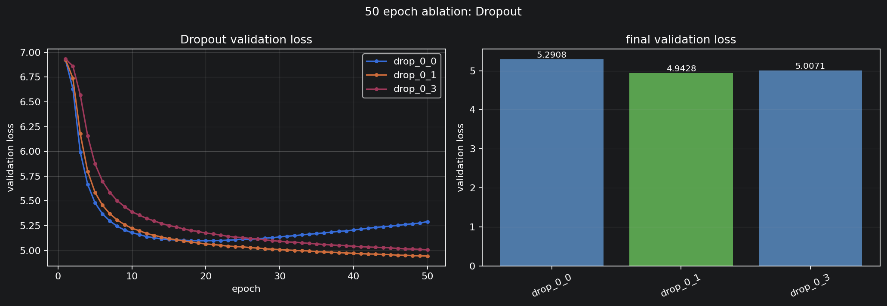

| drop_rate | final val_loss | best val_loss | best epoch |
| ---: | ---: | ---: | ---: |
| 0.0 | 5.2908 | 5.0968 | 20 |
| 0.1 | 4.9428 | 4.9428 | 50 |
| 0.3 | 5.0071 | 5.0071 | 50 |

dropout 0.1이 가장 낮았다. dropout 0.0은 epoch 20에서 best를 찍은 뒤 final loss가 5.2908까지 올라갔다.

### 8.3 Learning Rate

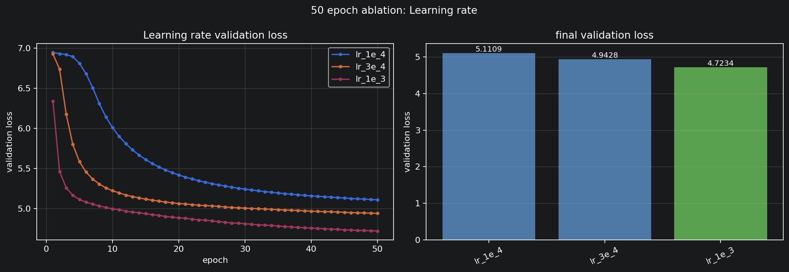

| learning_rate | final val_loss | best val_loss | best epoch |
| ---: | ---: | ---: | ---: |
| 1e-4 | 5.1109 | 5.1109 | 50 |
| 3e-4 | 4.9428 | 4.9428 | 50 |
| 1e-3 | 4.7234 | 4.7234 | 50 |

50 epoch 기준으로는 1e-3이 가장 낮았다.

### 8.4 Optimizer와 Weight Decay

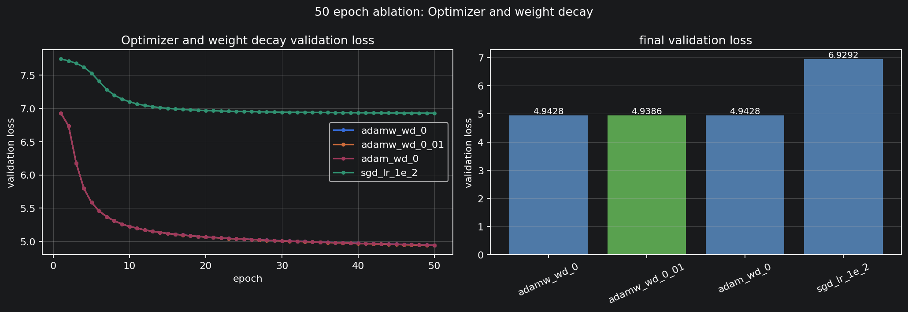

| 설정 | final val_loss | best val_loss | best epoch |
| --- | ---: | ---: | ---: |
| AdamW, weight_decay 0.0 | 4.9428 | 4.9428 | 50 |
| AdamW, weight_decay 0.01 | 4.9386 | 4.9386 | 50 |
| Adam, weight_decay 0.0 | 4.9428 | 4.9428 | 50 |
| SGD, learning_rate 1e-2 | 6.9292 | 6.9292 | 50 |

AdamW와 Adam은 거의 같았고, AdamW weight_decay 0.01이 아주 조금 낮았다. SGD는 loss가 거의 내려가지 않았다.

### 8.5 Vocab Size 참고 실험

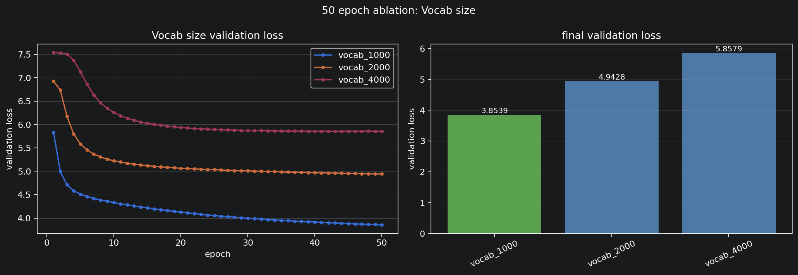

| vocab_size | final val_loss | best val_loss | best epoch |
| ---: | ---: | ---: | ---: |
| 1000 | 3.8539 | 3.8539 | 50 |
| 2000 | 4.9428 | 4.9428 | 50 |
| 4000 | 5.8579 | 5.8551 | 46 |

vocab_size는 loss 숫자를 직접 비교하지 않았다. vocab_size가 바뀌면 tokenization 단위와 class 수가 함께 바뀌기 때문에, 같은 validation loss 축 위에서 다른 hyperparameter처럼 해석하면 안 된다. 이 실험에서 확인할 수 있는 것은 vocab_size 변경이 token 수와 예측 class 수까지 바꾸는 큰 설계 변경이라는 점이다. 실제 vocab_size 선택은 loss 하나가 아니라 생성 품질, token 수, byte 조각 빈도, bits-per-byte 같은 지표를 함께 봐야 한다.

### 8.6 Context Length

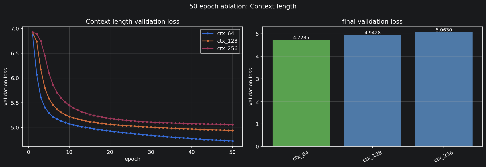

| context_length | final val_loss | best val_loss | best epoch |
| ---: | ---: | ---: | ---: |
| 64 | 4.7285 | 4.7285 | 50 |
| 128 | 4.9428 | 4.9428 | 50 |
| 256 | 5.0630 | 5.0630 | 50 |

50 epoch 기준으로는 context_length 64가 가장 낮았다. 이 데이터와 학습 길이에서는 짧은 context가 더 빠르게 loss를 낮췄다.

### 8.7 Embedding Dimension

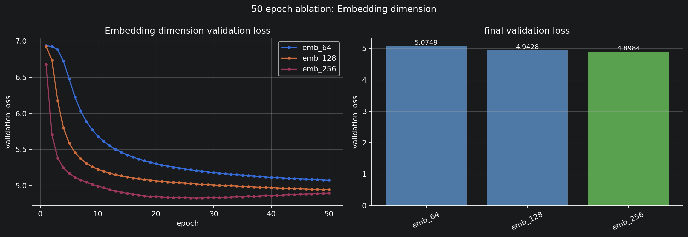

| emb_dim | final val_loss | best val_loss | best epoch |
| ---: | ---: | ---: | ---: |
| 64 | 5.0749 | 5.0749 | 50 |
| 128 | 4.9428 | 4.9428 | 50 |
| 256 | 4.8984 | 4.8284 | 27 |

emb_dim 256이 가장 낮은 best val_loss를 기록했다. 다만 epoch 27 이후 final loss는 4.8984까지 올라갔다.

### 8.8 Layer 수

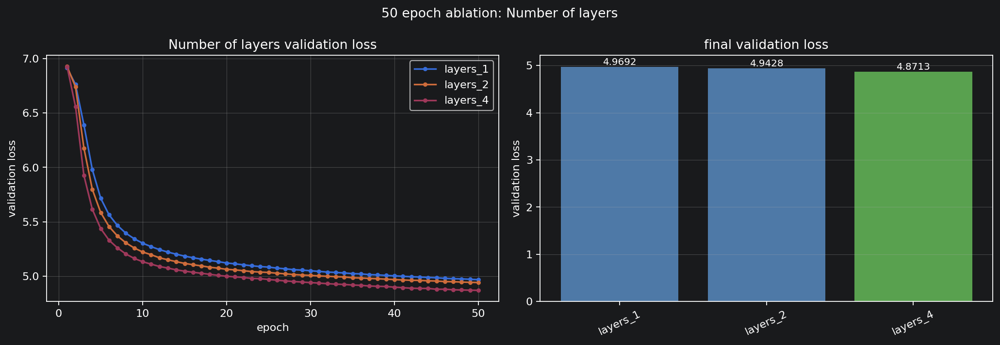

| n_layers | final val_loss | best val_loss | best epoch |
| ---: | ---: | ---: | ---: |
| 1 | 4.9692 | 4.9692 | 50 |
| 2 | 4.9428 | 4.9428 | 50 |
| 4 | 4.8713 | 4.8713 | 50 |

layer 수를 늘릴수록 validation loss가 낮아졌다. 4층은 2층보다 낮았지만 실행 시간도 104.0초에서 178.8초로 늘었다.

### 8.9 Attention Head 수

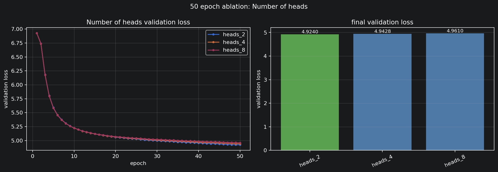

| n_heads | final val_loss | best val_loss | best epoch |
| ---: | ---: | ---: | ---: |
| 2 | 4.9240 | 4.9240 | 50 |
| 4 | 4.9428 | 4.9428 | 50 |
| 8 | 4.9610 | 4.9610 | 50 |

head 수 차이는 크지 않았고, 2 heads가 가장 낮았다.

### 8.10 FFN 확장 비율

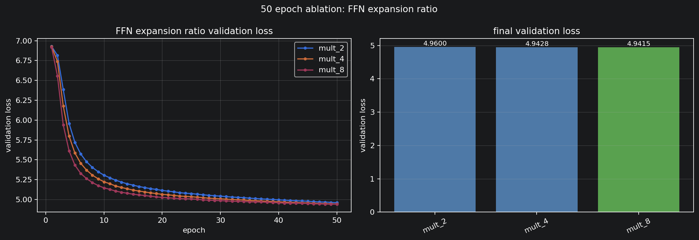

| FFN mult | final val_loss | best val_loss | best epoch |
| ---: | ---: | ---: | ---: |
| 2 | 4.9600 | 4.9600 | 50 |
| 4 | 4.9428 | 4.9428 | 50 |
| 8 | 4.9415 | 4.9406 | 49 |

FFN mult 8이 가장 낮았지만 mult 4와의 차이는 작았다.

### 8.11 Gradient Clipping

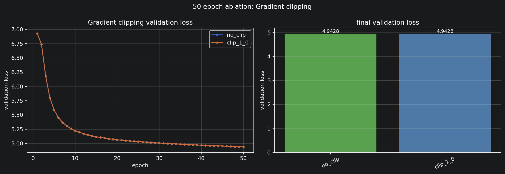

| 설정 | final val_loss | best val_loss | best epoch |
| --- | ---: | ---: | ---: |
| no_clip | 4.9428 | 4.9428 | 50 |
| clip_1.0 | 4.9428 | 4.9428 | 50 |

현재 설정에서는 gradient clipping 차이가 나타나지 않았다.

### 8.12 Batch Size

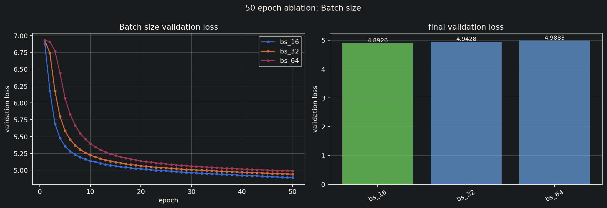

| batch_size | final val_loss | best val_loss | best epoch |
| ---: | ---: | ---: | ---: |
| 16 | 4.8926 | 4.8923 | 49 |
| 32 | 4.9428 | 4.9428 | 50 |
| 64 | 4.9883 | 4.9883 | 50 |

batch size 16이 가장 낮았고, 실행 시간은 195.4초로 가장 길었다. batch size 64는 가장 빨랐지만 final val_loss가 가장 높았다.

### 8.13 실험 한계

이번 ablation은 Basic 설정에서 한 번에 하나의 요소만 바꿔 50 epoch씩 비교했다. 이 방식은 어떤 요소가 loss에 영향을 주는지 보기 쉽지만, 좋은 값을 여러 개 조합했을 때도 같은 방향으로 좋아진다는 보장은 없다.

또한 모든 실험은 같은 seed 기준의 단일 실행이다. 따라서 작은 차이는 seed 변화에 따라 달라질 수 있다. 예를 들어 n_heads 2/4/8의 final val_loss 차이는 0.02 안팎이라 큰 결론으로 보기 어렵다. 반면 learning_rate, context_length, dropout 0.0처럼 차이가 크게 난 항목은 해석 근거가 더 강하다.

vocab_size 실험은 별도로 조심해서 봐야 한다. vocab_size가 바뀌면 tokenization 단위와 cross entropy의 class 수가 같이 바뀌므로, loss 숫자만으로 vocab_size 1000이 더 좋다고 결론내릴 수 없다. vocab_size 비교는 생성 품질, token 수, bits-per-byte 같은 지표와 함께 봐야 한다.

---

## 9. 미세조정 구현

| 항목 | 내용 |
| --- | --- |
| 파일 | `src/finetune.py` |
| 과제 | NSMC 리뷰 긍정/부정 분류 |
| Dataset 입력 | `{"text": str, "label": 0 또는 1}` |
| tokenizer 처리 | `add_bos_eos=True`, `max_length` 기준 padding/truncation |
| classifier | GPT hidden state 마지막 non-pad 위치 + Linear head |
| loss | cross entropy |
| train/eval | 평균 loss와 accuracy 반환 |

미세조정 모듈은 단위 테스트를 통과했다. 이후 `basic_monitor_best.pt`를 backbone 초기값으로 사용해 NSMC 감성 분류 fine-tuning을 진행했다.

fine-tuning 실험 설정은 다음과 같다.

| 항목 | 값 |
| --- | ---: |
| pretraining checkpoint | `checkpoints/basic_monitor_best.pt` |
| pretraining epoch | 1392 |
| train samples | 30,000 |
| validation samples | 6,000 |
| test samples | 6,000 |
| max_length | 128 |
| batch_size | 64 |
| learning_rate | 1e-4 |
| fine-tuning epoch | 3 |
| elapsed | 15.8초 |

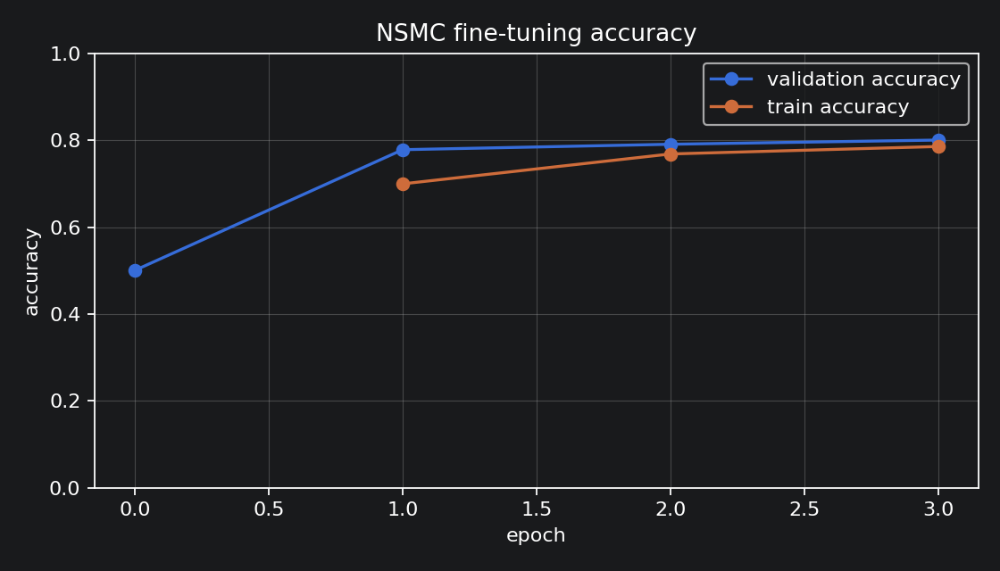

| epoch | train_loss | train_acc | val_loss | val_acc |
| ---: | ---: | ---: | ---: | ---: |
| 0 | - | - | 1.4921 | 0.5005 |
| 1 | 0.5786 | 0.6996 | 0.4674 | 0.7782 |
| 2 | 0.4779 | 0.7683 | 0.4469 | 0.7907 |
| 3 | 0.4502 | 0.7855 | 0.4273 | 0.8003 |

최종 test 결과는 다음과 같다.

| split | loss | accuracy |
| --- | ---: | ---: |
| test | 0.4224 | 0.8022 |

처음 classifier head를 붙인 직후 validation accuracy는 0.5005로 거의 무작위 분류 수준이었다. 3 epoch fine-tuning 후 validation accuracy는 0.8003, test accuracy는 0.8022까지 올라갔다. 이 결과는 pretrained checkpoint를 초기값으로 사용한 fine-tuning pipeline이 subset 기준 NSMC 분류 학습까지 동작했음을 보여준다. 다만 random initialization 또는 frozen backbone baseline과 비교하지 않았으므로, 이 수치만으로 사전학습 효과의 크기를 분리해 주장하지는 않았다.

이 실험은 subset 기준이므로 전체 train/validation/test 데이터 기준 성능과는 다를 수 있다. 전체 데이터 기준으로 측정하려면 노트북 62번째 코드 셀에서 `TRAIN_LIMIT`, `VAL_LIMIT`, `TEST_LIMIT`를 `None`으로 바꾸면 된다.

---

## 10. 실험 환경

| 항목 | 내용 |
| --- | --- |
| Python | 3.11.9 |
| PyTorch | 2.13.0.dev20260524+cu132 |
| CUDA | 13.2 |
| GPU | NVIDIA GeForce RTX 5090 |
| 주요 실행 파일 | `gpt-lab.ipynb` |
| 주요 checkpoint | `checkpoints/basic_monitor_best.pt` |
| 주요 실험 로그 | 로컬 산출물: `checkpoints/basic_monitor_history.json`, `checkpoints/ablation50_*.json`, `checkpoints/finetune_accuracy_report.json` |

data, vocab, checkpoint, ablation 결과 JSON은 로컬 실험 산출물이며 `.gitignore` 대상이다.

---

## 11. 결론

1. byte-level BPE부터 GPT model, pretraining loop, classifier fine-tuning module까지 과제 핵심 구현을 완료했다.
2. 단위 테스트와 전체 테스트를 모두 통과했다.
3. 작은 설정에서 파이프라인 동작을 확인한 뒤 Basic 학습을 진행했다.
4. Basic 모델은 epoch 1392에서 validation loss 4.5587까지 감소했다.
5. 900 epoch 이후에는 100 epoch 구간 평균 validation loss 감소량이 0.002 안팎으로 줄어 plateau에 가까운 흐름을 보였다.
6. 50 epoch ablation에서 activation은 SiLU 4.9352, GELU 4.9428로 가까웠고, Sigmoid는 4.9773으로 가장 높았다.
7. learning_rate 1e-3, context_length 64, emb_dim 256, n_layers 4, batch_size 16은 Basic 값보다 낮은 validation loss를 보여 다음 조합 실험 후보로 남겼다.
8. dropout 0.1은 세 후보 중 가장 낮았고, dropout 0.0은 epoch 20 이후 validation loss가 다시 증가했다.
9. fine-tuning은 subset 기준 validation accuracy 0.8003, test accuracy 0.8022를 기록했고, 사전학습 효과의 크기는 별도 baseline 비교가 필요하다.

---

## 12. 남은 작업과 개선 방향

- vocab_size별 cross entropy는 tokenization 단위가 달라지므로 생성 품질이나 bits-per-byte 같은 추가 지표와 함께 봐야 한다.
- ablation은 50 epoch 단일 변수 비교이므로, 좋은 값을 조합했을 때도 같은 방향으로 좋아지는지는 추가 검증이 필요하다.
- Basic 모델은 아직 문법 오류와 반복이 남아 있어 더 큰 모델 또는 더 긴 학습을 시도할 수 있다.
- fine-tuning은 subset 기준으로만 측정했으므로, 전체 데이터 기준 accuracy를 추가로 확인할 수 있다.
- fine-tuning 결과에서 사전학습 효과를 분리하려면 random initialization backbone 또는 frozen backbone baseline과 비교해야 한다.
- 다음 실험에서는 `learning_rate=1e-3`, `context_length=64`, `emb_dim=256`, `n_layers=4`, `batch_size=16`을 단계적으로 조합해 검증하는 것이 좋다.
